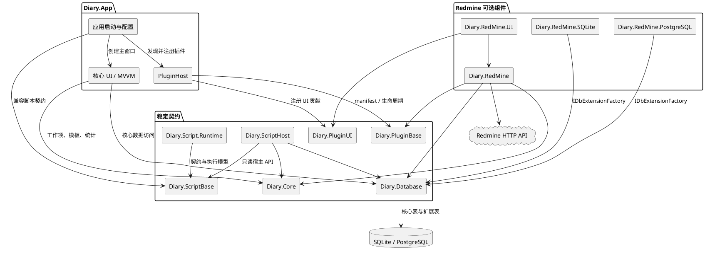
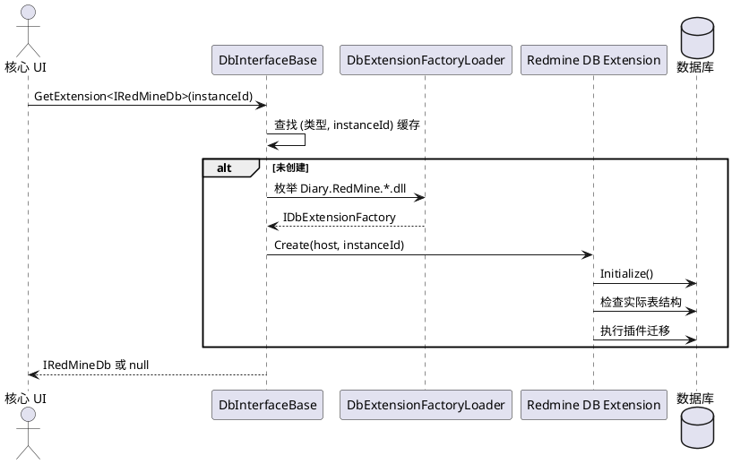

# DiaryApp 当前架构

## 1. 文档范围

本文描述当前代码已经实现的架构，不等同于 `TrackerPluginArchitecture.md` 中的目标方案。
代码基线：当前工作区源码。tracker 插件实例和 UI 贡献已具备通用注册链路，Redmine 已开启多实例支持。

当前架构的核心目标是：核心日记功能不依赖 Redmine；Redmine 通过插件契约、可选 UI 和数据库扩展接入；插件数据库可以独立迁移。

## 2. 总体结构



图表源文件：`Docs/diagrams/current-components.puml`。


## 3. 项目职责和依赖

| 项目 | 当前职责 | 关键边界 |
| --- | --- | --- |
| `Diary.App` | 启动、服务容器、插件发现、数据库选择、主窗口和 Tracker 配置对话框 | 设置通过右上角独立模态对话框编辑；固定导航页只创建一次，Tracker 动态页追加在其后并按配置刷新 |
| `Diary.Core` | 工作项、标签、模板、配置和统计模型 | 不应依赖具体 tracker 类型 |
| `Diary.Database` | 核心数据库抽象、provider 原语、扩展工厂加载 | 通过 `GetExtension<T>(instanceId)` 延迟取得可选扩展 |
| `Diary.PluginBase` | manifest、兼容性检查、插件入口、实例注册、迁移调度 | 不依赖 Avalonia 和具体 UI |
| `Diary.PluginUI` | tracker 配置页、管理页和编辑器扩展契约 | 由宿主把插件 UI 挂载到核心 UI |
| `Diary.ScriptBase` | 脚本版本化契约、描述符、诊断、执行请求和能力模型 | 不依赖核心数据库、DI 或 UI |
| `Diary.ScriptHost` | 受限脚本宿主 API，当前提供只读事项查询 | 只暴露不可变 DTO 和结构化错误 |
| `Diary.Script.Runtime` | 引擎注册、构建服务、目录加载、执行器和脚本管理器 | 已接入 App DI，启动时后台加载 application/editor 脚本 |
| `Diary.RedMine` | Redmine API、模型、配置、插件迁移和插件入口 | 当前仍是 Redmine 专用插件实现 |
| `Diary.RedMine.UI` | Redmine 设置、管理页、编辑器区域和缓存数据 | 通过工厂按实例注册 UI 贡献 |
| `Diary.RedMine.SQLite` | SQLite Redmine 数据访问实现 | 通过 `IDbExtensionFactory` 按 provider 加载 |
| `Diary.RedMine.PostgreSQL` | PostgreSQL Redmine 数据访问实现 | 与 SQLite 共享数据库契约 |

依赖方向应保持为：

```text
Diary.Core          <- Diary.Database <- Diary.RedMine.SQLite/PostgreSQL
       ^                    ^
       |                    |
Diary.PluginBase <- Diary.RedMine <- Diary.RedMine.UI -> Diary.PluginUI
       ^                                      ^
       +---------------- Diary.App ----------+
```

## 4. 启动和插件生命周期

`App.ConfigureServices()` 默认扫描二进制目录中的 `Diary.*.dll`，发现 `ITrackerPlugin` 实现后调用 `PluginHost.Register()`。使用 `--core-only` 启动参数时跳过 tracker 和 tracker UI 程序集扫描，只保留核心服务、数据库和主窗口启动链路。
兼容性检查通过才会注册服务并加入宿主插件列表；所有 `Diary.*.UI.dll` 都按可选程序集扫描，加载失败不会阻断核心启动。
兼容插件由宿主创建并加载配置，实例注册时通过 `PluginHostContext` 同时接收数据库、插件配置和通用实例配置项。`TrackerPluginLifecycleCoordinator` 统一枚举实例配置、调用插件实例注册、收集失败状态，并按已启用实例注册 UI/模板贡献；实例卸载默认只禁用并保留配置/数据，显式删除数据时才调用插件清理契约。插件注册前，宿主会把本次发现的 manifest 集合放入兼容性上下文，校验必选依赖的存在性和版本范围；必选依赖形成环的插件不会进入服务注册。


图表源文件：`Docs/diagrams/startup-lifecycle.puml`。


插件状态目前使用 `PluginState` 表示兼容、阻塞、迁移失败等结果。插件迁移失败会返回 `MigrationFailed`，不会让 `PluginHost.Migrate()` 报告启用成功；核心启动仍由应用层决定是否继续使用核心功能。

核心模式可通过 `Diary.App --core-only` 启动，不加载任何 tracker 插件或插件 UI，适合验证无 Redmine 程序集时的核心日记、编辑器和模板功能。该选项只影响当前进程，不修改插件配置和数据库数据。

## 5. 数据库分层和扩展

核心数据库由 `DbInterfaceBase` 负责连接、核心 schema 版本和工作项数据。Redmine 表不通过核心 CRUD 接口访问，而是通过数据库扩展工厂动态发现：

1. `DbExtensionFactoryLoader` 从程序目录加载 `Diary.*.dll` 并发现数据库扩展工厂。
2. 找到支持当前 provider 和 `IRedMineDb` 的 `IDbExtensionFactory`。
3. `DbInterfaceBase.GetExtension<IRedMineDb>(instanceId)` 延迟创建扩展并按类型、实例 ID 缓存。
4. SQLite 或 PostgreSQL 扩展使用 `IDbExtensionHost` 执行 provider 无关的查询和迁移 SQL。



图表源文件：`Docs/diagrams/database-extension.puml`。


核心表和 Redmine 表目前共享同一个物理数据库，但职责分离：

```text
核心：work_items、work_notes、work_tags、work_item_tags、data_versions
Redmine：plugin_data_versions、redmine_projects、redmine_activities、
         redmine_issues、redmine_time_entries
```

## 6. Redmine schema 迁移

当前 Redmine 数据库 schema 为版本 1：

- 版本 0 -> 1：直接创建带 `instance_id` 的 Redmine 多实例表。

迁移版本记录在 `plugin_data_versions`，插件 ID 为 `tracker.redmine`。当前实现只提供 0 -> 1 迁移；SQLite 和 PostgreSQL 各自实现 provider 结构探测和 SQL 执行。

初始化不只相信 `plugin_data_versions`：如果发现历史 Redmine 表存在但缺少 `instance_id`，当前实现会将其识别为旧结构并按版本 1 处理；当前代码不会自动执行旧结构到多实例结构的 1 -> 2 改造。没有 Redmine 表时则从版本 0 开始。

迁移失败时：

- `Initialize()` 返回失败。
- 不应把失败状态写成 schema 1。
- 插件数据不应被删除。
- 核心工作项数据库不应因此被删除或回滚到不可用状态。

## 7. 多实例模型

实例身份由 `(PluginId, InstanceId)` 确定。`PluginInstanceRegistry` 创建实例时检查：

- 相同插件和实例 ID 不可重复。
- manifest 未声明 `SupportsMultipleInstances` 时，同一插件只能有一个实例。
- 插件创建出的实例必须返回匹配的 `PluginId` 和 `InstanceId`。

Redmine 数据库扩展已经使用实例 ID 过滤所有项目、问题、活动和工时记录，默认实例 ID 为 `redmine.default`。配置层已经支持实例列表、启用状态、显示名称和单独配置。

当前限制：插件宿主和数据库扩展已经支持多实例，所有扩展创建调用都显式传入插件迁移链。Redmine 插件程序集仍由 `Diary.App.csproj` 的构建目标生成并复制到输出目录，运行时再通过目录扫描发现；尚未实现独立插件包目录或安装器。

## 8. UI 和编辑器扩展

Redmine UI 通过 `Diary.PluginUI` 的契约接入：

- `ITrackerConfigurationProvider`：提供默认配置、校验和设置页。
- `ITrackerUiContribution`：提供导航页、管理页、编辑器区域和模板贡献。
- `ITrackerEditorExtension`：将 tracker 绑定和上传能力放入工作项编辑器。

核心编辑器从 `TrackerUiContributionRegistry` 获取按实例创建的 `ITrackerUiContribution`，不直接依赖 Redmine 具体 ViewModel。模板只保存核心字段和默认标签，Tracker 活动、问题等默认值由标签规则推导；当前 Redmine UI 仍保留 `IRedMineUiData` 和部分 Redmine 专用数据缓存，用于管理页和选择器。

## 9. 数据保存边界

当前设计把本地保存和远程 API 调用分开：

```text
核心工作项 + 本地 tracker 绑定
        -> 本地数据库事务
        -> 成功提交
        -> 远程 Redmine API 上传
        -> 成功或失败状态单独反馈
```

远程 API 失败不应丢失核心日记或本地绑定。当前外部 API 集成测试存在依赖服务状态的 403、500 和 422，不能作为本地数据库契约测试的替代品。

## 10. 插件配置 schema 迁移

插件配置文件统一支持以下包格式：

```json
{
  "PluginId": "tracker.redmine",
  "SchemaVersion": 1,
  "Payload": {}
}
```

宿主加载插件配置时先读取原始 JSON，再校验插件 ID 和版本，按插件提供的
`IPluginConfigurationMigration` 链逐步迁移 Payload，最后才反序列化并保存新包。
迁移步骤应原位修改 JSON 对象，以便未知字段随 Payload 一起保留。旧插件没有配置迁移链时，
仍按旧的直接配置格式加载，不强制改写其文件。

迁移任一步失败时，原始文件不被覆盖，插件进入 `ConfigurationMigrationFailed` 状态，
核心日记和其他插件继续启动；诊断页显示错误详情。Redmine 当前提供 0 -> 1 -> 2 迁移：
先将旧的单实例根字段转换为 `redmine.default` 实例，再为实例补充导航图标，同时保留未知字段。

敏感配置使用 `StorageFileAttribute` 的加密键保存，API Key 等字段通过 `ConfigureTextAttribute`
标记为密码输入。编辑器只在用户显式修改后更新字段，配置迁移和日志导出均不输出明文密钥。

## 11. 当前已知缺口

- `SupportsMultipleInstances` 已接入 Redmine manifest、实例配置、导航和编辑器上下文；其他插件仍需按自身能力声明该标志。
- 插件实例注册、数据库扩展迁移和 UI/模板注册已收敛到统一生命周期；数据库扩展的具体创建和迁移仍由插件实现。
- 主程序已经通过构建目标复制 Redmine 插件程序集，后续可将复制源替换为独立插件包目录。
- 配置 schema 迁移、诊断状态、错误详情、迁移重试、实例启用/禁用和诊断日志 ZIP 导出已接入通用链路。
- 已覆盖无 tracker 时插件生命周期、核心编辑器和模板测试，并通过 Headless 桌面生命周期验收 core-only 主窗口构建。
- 远程同步队列、重试和每实例操作状态仍需完善。

## 12. 自定义事项查询

核心查询使用 `WorkItemQuery`，由 `DbInterfaceBase.QueryWorkItems()` 统一定义 provider 契约。
SQLite 和 PostgreSQL 都支持日期范围、标题/备注关键字、优先级、分页以及五种标签模式：
`Ignore`、`Any`、`All`、`None`、`Exact`。

查询使用参数绑定和相关子查询，结果按日期和事项 ID 稳定排序。共享 `DbContractTests` 同时验证两个 provider。
左侧导航已经提供“事项查询”页面；统计标签详情也已迁移到该接口。

查询页面支持失败时保留结果、默认上限、批量标签加载、结果跳转和保存查询条件。
`Diary.ScriptHost` 已提供受限只读事项查询 API。详细设计见
[`WorkItemQueryDesign.md`](WorkItemQueryDesign.md)。

## 13. 标签自动化规则

`WorkEditorViewModel.AddTags()` 统一用户、模板和批量标签添加。只有实际新增标签才按输入顺序调用
`ITagAutomationCoordinator`；数据库加载、重新同步和删除标签不会触发规则。

Tracker 编辑器可以选择实现 `ITrackerTagDefaults`。当前 Redmine 编辑器实现该能力，并从对应
`RedMineInstanceSettings.TagRules` 读取实例级规则。规则按优先级为 Activity 和 Issue 填充默认值，
已有字段不会被覆盖，删除标签也不会反向清除字段。

Redmine 实例设置页和核心标签编辑器复用规则编辑 ViewModel，配置支持 schema 迁移及嵌套未知字段保留。
协调器按实例隔离异常并返回应用字段、冲突、无效目标和错误；同优先级规则按配置顺序稳定裁决。

详细设计见 [`TagAutomationDesign.md`](TagAutomationDesign.md)。

## 14. 脚本运行时

`Diary.Script.Runtime` 当前提供 `IScriptManager`、`ScriptCatalog`、构建服务和
`ScriptExecutor` 的最小实现。执行器为每次执行生成 ID，校验目标和超时参数，
隔离脚本异常，并返回成功、失败、取消、超时或拒绝状态；能力检查由
`ScriptExecutionContext` 和 `Diary.ScriptHost` 的只读 API 执行。

当前尚未接入独立后台任务调度、Lua 或 Python 引擎。Lua/Python 的目标方案已确定为独立 worker、按
`EngineName` 路由、共享只读 HostCall 协议和结构化运行时降级诊断；执行历史目前为内存数据，脚本包和强隔离仍需继续扩展。

## 15. 维护约定

- 新增 tracker 不得把具体类型加入 `Diary.Core` 或核心编辑器。
- 新增数据库扩展必须实现 provider 契约测试，并验证缺失程序集时核心数据库仍可启动。
- schema 迁移必须幂等，成功写入版本号前不得假设结构已经完成。
- 涉及插件、数据库扩展或实例隔离的改动，应同时更新本文档和对应图表源文件。
- `TrackerPluginArchitecture.md` 继续作为目标架构和改造计划；本文作为当前实现基线。
