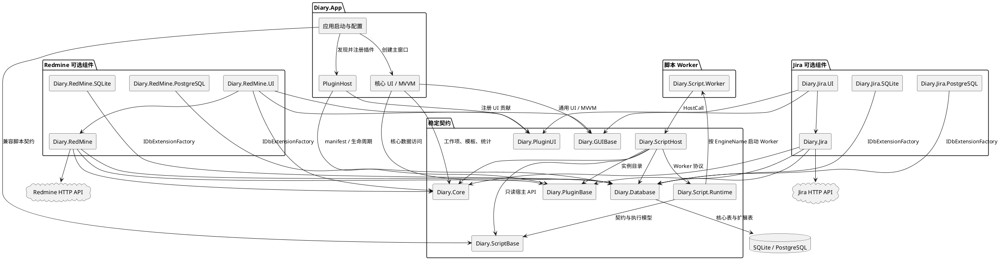
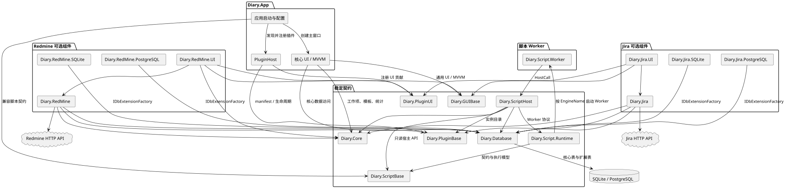
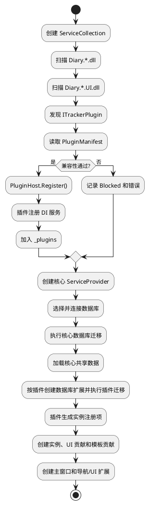
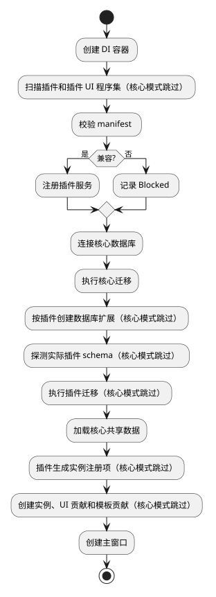
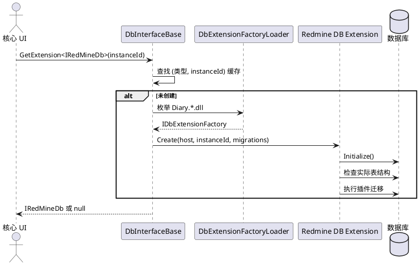
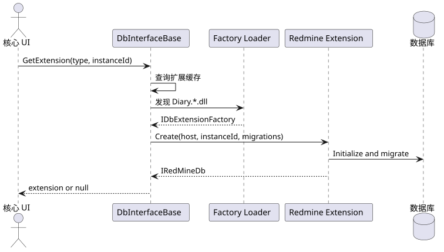

# DiaryApp 当前架构

## 1. 文档范围

本文描述当前代码已经实现的架构，不等同于 `TrackerPluginArchitecture.md` 中的目标方案。
代码基线：当前工作区源码。tracker 插件实例和 UI 贡献已具备通用注册链路，Redmine 已开启多实例支持。
完整的当前 UI 页面、操作入口、条件可见状态和自动化覆盖清单见 [`UiFeatureInventory.md`](UiFeatureInventory.md)。

当前架构的核心目标是：核心日记功能不依赖 Redmine；Redmine 通过插件契约、可选 UI 和数据库扩展接入；插件数据库可以独立迁移。

## 2. 总体结构



图表源文件：`Docs/diagrams/current-components.puml`。



## 3. 项目职责和依赖

| 项目 | 当前职责 | 关键边界 |
| --- | --- | --- |
| `Diary.App` | 启动、服务容器、插件发现、数据库选择、主窗口、Tracker 配置及独立 CrashDump 捕获/提示模式 | 程序设置以及 Tracker 配置/插件状态均通过右上角独立模态对话框打开；终止性托管异常由独立 DiagnosticsClient 进程生成本地 Triage Dump，不依赖已经崩溃的正常应用 UI |
| `Diary.Core` | 工作项、标签、模板、配置和统计模型 | 不应依赖具体 tracker 类型 |
| `Diary.Database` | 核心数据库抽象、provider 原语、扩展工厂加载 | 通过 `GetExtension<T>(instanceId)` 延迟取得可选扩展 |
| `Diary.GUIBase` | 跨页面共享的通用 UI、ViewModel、转换器、资源和事件消息 | 不依赖具体 tracker 类型和插件实现 |
| `Diary.PluginBase` | manifest、兼容性检查、插件入口、实例注册、迁移调度 | 不依赖 Avalonia 和具体 UI |
| `Diary.PluginUI` | tracker 配置页、管理页和编辑器扩展契约 | 由宿主把插件 UI 挂载到核心 UI；多个配置提供者在配置对话框中按 Tab 分开展示 |
| `Diary.Db.SQLite` | SQLite 核心数据库 provider | 提供核心 schema、查询和事务实现；tracker 扩展由 `Diary.Database` 的扩展工厂加载器按 `Diary.*.dll` 发现 |
| `Diary.Db.PostgreSQL` | PostgreSQL 核心数据库 provider | 提供核心 schema、查询和事务实现；tracker 扩展由 `Diary.Database` 的扩展工厂加载器按 `Diary.*.dll` 发现 |
| `Diary.ScriptBase` | 脚本版本化契约、描述符、诊断和执行请求 | 不依赖核心数据库、DI 或 UI |
| `Diary.ScriptHost` | 工作项查询、日志项/模板日志项、Tracker 只读目录及系统交互的宿主契约 | 数据访问和副作用均由宿主 API 控制，返回 DTO 或结构化错误 |
| `Diary.Script.Runtime` | 引擎注册、构建服务、目录加载、执行器和脚本管理器 | 已接入 App DI；应用启动时通过共享加载状态在后台预加载 application/editor 脚本，脚本管理页复用结果 |
| `Diary.Script.Worker` | C#、Lua Worker 进程入口、协议适配和受限执行上下文 | 只通过 stdin/stdout 协议与宿主通信；不直接访问 App、DI、数据库或 UI |
| `Diary.Survey` | 调查协议（v1/v2）、调查者和受访者收发实现 | 不依赖 UI；App 层负责端口与页面装配 |
| `Diary.MigrationTool` | 从旧 DiaryToolpp 数据库导入核心数据 | 导入的工作项持久化为只读，不迁移 Tracker 信息 |
| `Diary.RedMine` | Redmine API、模型、配置、插件迁移和插件入口 | 当前仍是 Redmine 专用插件实现 |
| `Diary.RedMine.UI` | Redmine 设置、管理页、编辑器区域和缓存数据 | 通过工厂按实例注册 UI 贡献 |
| `Diary.RedMine.SQLite` | SQLite Redmine 数据访问实现 | 通过 `IDbExtensionFactory` 按 provider 加载 |
| `Diary.RedMine.PostgreSQL` | PostgreSQL Redmine 数据访问实现 | 与 SQLite 共享数据库契约 |
| `Diary.Jira` | Jira API、模型、配置、插件迁移和插件入口 | 与 Redmine 平行的独立插件实现 |
| `Diary.Jira.UI` | Jira 设置、管理页和编辑器区域 | 通过工厂按实例注册 UI 贡献 |
| `Diary.Jira.SQLite` | SQLite Jira 数据访问实现 | 通过 `IDbExtensionFactory` 按 provider 加载 |
| `Diary.Jira.PostgreSQL` | PostgreSQL Jira 数据访问实现 | 与 SQLite 共享数据库契约 |

依赖方向应保持为：

```text
Diary.Core          <- Diary.Database <- Diary.RedMine.SQLite/PostgreSQL
       ^                    ^
       |                    |
Diary.PluginBase <- Diary.RedMine <- Diary.RedMine.UI -> Diary.PluginUI
       ^                                      ^
       +---------------- Diary.App ----------+
```

## 4. 启动和插件生命周期

`App.ConfigureServices()` 默认扫描二进制目录中的 `Diary.*.dll`，发现 `ITrackerPlugin` 实现后调用 `PluginHost.Register()`。使用 `--core-only` 启动参数时跳过 tracker 和 tracker UI 程序集扫描，只保留核心服务、数据库和主窗口启动链路。
兼容性检查通过才会注册服务并加入宿主插件列表；所有 `Diary.*.UI.dll` 都按可选程序集扫描，加载失败不会阻断核心启动。
兼容插件由宿主创建并加载配置，实例注册时通过 `PluginHostContext` 同时接收数据库、插件配置和通用实例配置项。`TrackerPluginLifecycleCoordinator` 统一枚举实例配置、调用插件实例注册、收集失败状态，并按已启用实例注册 UI/模板贡献；实例卸载默认只禁用并保留配置/数据，显式删除数据时才调用插件清理契约。插件注册前，宿主会把本次发现的 manifest 集合放入兼容性上下文，校验必选依赖的存在性和版本范围；必选依赖形成环的插件不会进入服务注册。



图表源文件：`Docs/diagrams/startup-lifecycle.puml`。



插件状态目前使用 `PluginState` 表示兼容、阻塞、迁移失败等结果。插件迁移失败会返回 `MigrationFailed`，不会让 `PluginHost.Migrate()` 报告启用成功；核心启动仍由应用层决定是否继续使用核心功能。

核心模式可通过 `Diary.App --core-only` 启动，不加载任何 tracker 插件或插件 UI，适合验证无 Redmine 程序集时的核心日记、编辑器和模板功能。该选项只影响当前进程，不修改插件配置和数据库数据。
主窗口左上角应用图标菜单提供“重启程序”。命令先标记重启请求并复用正常退出流程，等待 `PreShutdownAsync` 停止调查服务、脚本 Worker、保存配置并释放 DI；`Program.Main` 在 Avalonia 生命周期返回且 `SingletonApp` 释放文件锁和命名管道后，才以原可执行文件和命令行参数启动新实例，避免新实例被单实例守卫拦截。框架依赖方式通过 `dotnet Diary.App.dll` 启动时会保留托管入口程序集参数。

应用初始化阶段会立即启动脚本目录的后台异步加载。目录发现、元数据读取和脚本构建在后台任务中执行；脚本管理页首次显示时复用正在进行的加载任务或已完成结果，只有手动重新加载、脚本编辑保存或编译检查才会强制重新扫描。
调查功能的接收循环使用各自的 `CancellationToken`，消息处理器在接收任务中以可等待任务执行；处理器异常会记录并通过 `ReceiveMessageHandlerError` 诊断，不再由未观察的 fire-and-forget 任务承载。`AppSurveyor.StopServerAsync()` 和 `AppRespondent.ShutdownAsync()` 先取消接收，再等待接收循环和消息处理完成后释放 NNG 资源；应用配置重载和退出流程都等待这些异步生命周期任务。保留的无返回值 `StopServer()`/`Shutdown()` 仅用于兼容调用并主动观察后台任务，UI 路径不使用同步等待。

调查页默认选择兼容查询，兼容查询 v1 会完全隐藏扩展条件卡片，用户显式切换到扩展查询 v2 后才显示并配置筛选、分组和明细，避免由字段内容隐式改变协议。页面布局以全宽查询配置为主，查询卡将标题与节点摘要、模式与日期、计算与执行压缩为三行，节点探测只在查询卡标题区显示状态和操作入口，完整节点能力通过独立 `OverlayDialog` 查看；扩展条件和结果区分层占满可用宽度，结果区独立滚动；查询状态会显示已收到的节点数量和节点错误，能力结果统一调度到 UI 线程更新。设置模型生成的 `Expander` 显式使用 `.Settings` 类，模板标题字号、颜色和内容边框样式仅匹配 `Expander.Settings`，不会泄漏到调查结果等普通折叠控件。`SurveyUserGuide.md` 作为用户文档复制到构建和发布目录，页面可调用系统默认程序直接打开。

工作项上传的远程协调可以从后台线程执行，但 `WorkEditorViewModel.Upload()` 完成后统一通过 Avalonia UI Dispatcher 更新 `UploadResults`、锁定状态和状态绑定，避免后台线程直接修改绑定集合。

事件记录页的 `DailyWorks` 使用统一的优先级、ID 排序规则：`WorkPriorities` 升序后按持久化工作项 ID 升序。日期加载、复制新增和每次工作项保存后都会重排；重排使用 `ObservableCollection.Move()`，避免通过清空集合破坏当前选中项，并在移动期间抑制由选择变化触发的重复保存。

脚本宿主的普通日志项和模板日志项创建 API 接收应用层提供的数据库变更回调。只有 provider 事务真实提交成功后才调用该回调；应用内执行和 Worker HostCall 均将其映射为 `DbChangedEvent.ShareData`，事件记录页随后在 UI Dispatcher 上重新读取当前日期。Preview、幂等重放和失败回滚不会发送变更通知，通知回调自身失败也不改变已经提交的脚本结果。

## 5. CrashDump 与诊断进程

`Diary.App` 在正常模式之外提供 `--capture-crash-dump` 和 `--show-crash-report` 两个内部模式。
终止性托管异常到达 `AppDomain.UnhandledException` 后，正常进程启动独立捕获进程；捕获进程使用
`Microsoft.Diagnostics.NETCore.Client` 对目标 PID 生成 Triage Dump，再启动不加载数据库、插件和脚本的最小 Avalonia 提示窗口。
崩溃提示窗口将异常与 Dump 详情放入可滚动区域，底部操作始终可见，长路径可选择复制且窗口允许调整大小。
Dump 默认位于 LocalApplicationData 下的 `Diary.App/CrashDumps`，只保留最近 5 个且不自动上传。
详细边界见 [`CrashDumpDesign.md`](CrashDumpDesign.md)。

## 6. 数据库分层和扩展

核心数据库由 `DbInterfaceBase` 负责连接、核心 schema 版本和工作项数据。Redmine 表不通过核心 CRUD 接口访问，而是通过数据库扩展工厂动态发现：

1. `DbExtensionFactoryLoader` 从程序目录加载 `Diary.*.dll` 并发现数据库扩展工厂。
2. 找到支持当前 provider 和 `IRedMineDb` 的 `IDbExtensionFactory`。
3. `DbInterfaceBase.GetExtension<IRedMineDb>(instanceId)` 延迟创建扩展并按类型、实例 ID 缓存。
4. SQLite 或 PostgreSQL 扩展使用 `IDbExtensionHost` 执行 provider 无关的查询和迁移 SQL。



图表源文件：`Docs/diagrams/database-extension.puml`。



核心表和 Redmine 表目前共享同一个物理数据库，但职责分离：

```text
核心：work_items、work_notes、work_tags、work_item_tags、tag_extra_field_definitions、
      work_item_extra_field_values、data_versions、diary_schema_metadata、diary_schema_migrations
Redmine：plugin_data_versions、redmine_projects、redmine_activities、
         redmine_issues、redmine_time_entries
Jira：plugin_data_versions（与 Redmine 共用同一张表）、jira_projects、
      jira_issues、jira_work_entries
```

当前表结构的 ERD 图见 [`diagrams/database-schema.puml`](diagrams/database-schema.puml)。

### 核心数据迁移与发布门禁

数据库兼容性不再只依赖 `data_versions`。`DbInterfaceBase.CheckCompatibility()` 综合检查 provider 身份和能力、
声明数据版本、迁移元数据、规范化 schema fingerprint，以及 provider 数据完整性检查；只有
`Compatible` 状态才允许业务层写入。详细设计见 [`DatabaseCompatibilityDesign.md`](DatabaseCompatibilityDesign.md)。

`DbInterfaceBase.MigrateTo()` 按 `VersionFrom -> VersionTo` 连续链逐步迁移。每一步都在 provider 事务中执行，并要求迁移实现写入准确的目标版本；迁移返回失败、抛异常、未推进版本、迁移链断裂、
越过目标版本或请求降级时均停止，未提交步骤由 SQLite/PostgreSQL 回滚。迁移开始、结束和失败会写入
`diary_schema_metadata`，成功步骤写入 `diary_schema_migrations`，每个已提交步骤会先把新版本写回 `Running` 状态，
全部步骤完成后必须重新读取结构并通过兼容性复检，最后才写入 `Stable` 状态。

当前核心数据版本仍为 `1.0.0`（`0x10000`），与上一正式版本一致，因此两个 provider 的
`DbRecords.GetMigration()` 在当前版本返回 `null`。`ProviderMigrationRegistrationTests` 锁定这一契约：
未来提升 `DataVersion.VersionCode` 时，必须同时登记 SQLite/PostgreSQL 迁移并更新上一正式版本基线。
共享 `DbContractTests` 还验证成功迁移保留工作项、标签和备注，失败迁移回滚版本写入且不丢失原业务数据。
迁移开始前，SQLite 使用在线备份 API 在数据库同目录的 `Backups` 下生成带源/目标版本的独立快照，
备份失败会阻止迁移。数据库设置还提供 SQLite 手动备份、校验和还原入口：还原任务先暂存，下一次启动时替换数据库文件，
启动连接、迁移或兼容性复检失败会恢复还原前安全副本。SQLite 备份覆盖同一物理数据库中的核心表和 Tracker 扩展表。

PostgreSQL provider 通过 PostgreSQL Client 进程生成 custom-format 备份并执行非覆盖式还原；设置中已增加 PostgreSQL Client `bin` 目录：
Windows 必须配置，Linux 未配置时搜索 `PATH`，必须同时找到 `pg_dump` 和 `pg_restore` 才报告工具可用。还原前只查询当前用户、目标数据库、
服务器版本、`rolsuper`/`rolcreatedb`、`public` schema 必要权限和 DiaryApp 已知表；目标不存在时仅在具备 `CREATEDB` 时自动创建，
否则要求在 PostgreSQL 设置中填写已有空数据库。还原目标不得与当前数据库相同；还原成功后先切换当前进程到目标库，跳过幂等初始化并按归档原貌执行兼容性检查，
只有检查和迁移复检通过后才持久化新数据库名。失败时恢复原配置；自动创建的目标库会删除，用户提供的已有空库只清理本次恢复出的 DiaryApp 已知表。
核心复检后还会检查 RedMine/Jira 已知表组是否完整。PostgreSQL 工具调用设置版本、归档和长任务超时，超时会终止子进程树并对输出中的密码脱敏。
工具缺失时退化为不支持。备份范围、最小权限预检和后续增强策略见
[`DatabaseBackupRestoreDesign.md`](DatabaseBackupRestoreDesign.md)。

当前产品支持范围为 Windows 和 Linux；macOS 暂不纳入产品支持、发布产物和稳定性验证范围。
主程序不再把字体编译进 DLL。发布时将 Noto Sans Mono CJK SC 及其 SIL Open Font License 1.1 授权文本作为独立文件复制到 `Fonts/`，以中英文 2:1 等宽字形提供应用默认字体和 CJK 后备；OpenMoji 已删除且不再随包发布。`ViewConfig.FontSource` 的新配置默认值为“默认字体”，视图设置同时提供“跟随系统”、已安装系统字体和外部 `.ttf`/`.otf` 文件；已有用户保存的来源字符串保持原行为。`AppFontService` 在启动和设置保存时统一校验字体，通过 `FontManager` 动态替换文件字体集合，并更新全局 `AppFontFamily` 动态资源，使现有窗口无需重启即可重新布局和渲染。显式选择默认字体但随包文件缺失时回退平台默认字体；无效系统字体、自定义文件缺失、文件不可识别或运行时注册失败时优先回退随包字体，随包字体也不可用时再回退平台默认字体，避免阻断启动和设置保存。Linux 仍需由系统提供 Emoji 字体。
CI 在 Windows 和 Ubuntu 上执行 Release 构建与全量测试，并固定 Python 3.10；
`DIARY_REQUIRE_PYTHON_TESTS=1` 要求两端真实执行 C#、Lua、Python Worker 进程测试，运行时不可用即失败。
Ubuntu 门禁另通过 `DIARY_REQUIRE_POSTGRES_TESTS=1` 强制启动 PostgreSQL Testcontainers，容器不可用即失败；
Windows 用于覆盖平台构建和 Windows 专用运行路径。标签发布在对应原生 Runner 上分别生成 `win-x64` 和
`linux-x64` 自包含包，并在压缩前检查 Tracker 插件程序集和脚本 Worker 是否齐全。当前发布产物仍是供手动下载和解压的完整 ZIP，
客户端尚未实现应用包检查、下载、替换或回滚。后续更新采用规范化逐文件 SHA-256 清单、抽象更新源和独立更新器，详细设计见
[`ApplicationUpdateDesign.md`](ApplicationUpdateDesign.md)；服务器协议适配和客户端实现均仍待开发。

## 7. Redmine schema 迁移

当前 Redmine 数据库 schema 为版本 1：

- 版本 0 -> 1：直接创建带 `instance_id` 的 Redmine 多实例表。

迁移版本记录在 `plugin_data_versions`，插件 ID 为 `tracker.redmine`。当前实现只提供 0 -> 1 迁移；SQLite 和 PostgreSQL 各自实现 provider 结构探测和 SQL 执行。

初始化不只相信 `plugin_data_versions`：如果发现历史 Redmine 表存在但缺少 `instance_id`，当前实现会将其识别为旧结构并按版本 1 处理；当前代码不会自动执行旧结构到多实例结构的 1 -> 2 改造。没有 Redmine 表时则从版本 0 开始。

迁移失败时：

- `Initialize()` 返回失败。
- 不应把失败状态写成 schema 1。
- 插件数据不应被删除。
- 核心工作项数据库不应因此被删除或回滚到不可用状态。

## 8. 多实例模型

实例身份由 `(PluginId, InstanceId)` 确定。`PluginInstanceRegistry` 创建实例时检查：

- 相同插件和实例 ID 不可重复。
- manifest 未声明 `SupportsMultipleInstances` 时，同一插件只能有一个实例。
- 插件创建出的实例必须返回匹配的 `PluginId` 和 `InstanceId`。

Redmine 数据库扩展已经使用实例 ID 过滤所有项目、问题、活动和工时记录，默认实例 ID 为 `redmine.default`。配置层已经支持实例列表、启用状态、显示名称和单独配置。

当前限制：插件宿主和数据库扩展已经支持多实例，所有扩展创建调用都显式传入插件迁移链。Redmine 和 Jira 共 8 个插件程序集仍由 `Diary.App.csproj` 的构建目标生成并复制到输出目录，运行时再通过目录扫描发现；尚未实现独立插件包目录或安装器。

## 9. UI 和编辑器扩展

Redmine 和 Jira UI 通过 `Diary.PluginUI` 的契约接入：

- `ITrackerConfigurationProvider`：提供默认配置、校验和设置页。
- `ITrackerUiContribution`：提供导航页、管理页、编辑器区域和模板贡献。
- `ITrackerEditorExtension`：将 tracker 绑定和上传能力放入工作项编辑器。

核心编辑器从 `TrackerUiContributionRegistry` 获取按实例创建的 `ITrackerUiContribution`，不直接依赖 Redmine 具体 ViewModel。模板只保存核心字段和默认标签，Tracker 活动、问题等默认值由标签规则推导；当前 Redmine UI 仍保留 `IRedMineUiData` 和部分 Redmine 专用数据缓存，用于管理页和选择器。
核心编辑器的一般信息区域使用统一标签列和内容列，耗时输入保持足够宽度并与快捷时长、优先级并列；日记页左侧工作项列表按标题、耗时/标签、保存与同步状态分层展示，列表项只依赖 `WorkEditorViewModel` 的通用状态属性，不引入具体 Tracker 类型。

## 10. 数据保存边界

当前设计把本地保存和远程 API 调用分开：

```text
核心工作项 + 本地 tracker 绑定
        -> 本地数据库事务
        -> 成功提交
        -> 远程 Tracker API 上传（Redmine / Jira）
        -> 成功或失败状态单独反馈
```

远程 API 失败不应丢失核心日记或本地绑定。Jira 和 Redmine 的工作项绑定表直接保存最近一次上传状态、错误文本和尝试时间；成功状态仍以远程 ID 为最终锁定依据，网络异常或本地状态写入失败时记录为 `Uncertain`，避免用户无条件重复追加远程工时。
当前外部 API 集成测试存在依赖服务状态的 403、500 和 422，不能作为本地数据库契约测试的替代品。

## 11. 插件配置 schema 迁移

插件配置文件统一支持以下包格式：

```json
{
  "PluginId": "tracker.redmine",
  "SchemaVersion": 1,
  "Payload": {}
}
```

宿主加载插件配置时先读取原始 JSON，再校验插件 ID 和版本，按插件提供的
`IPluginConfigurationMigration` 链逐步迁移 Payload，最后才反序列化并保存新包。
迁移步骤应原位修改 JSON 对象，以便未知字段随 Payload 一起保留。旧插件没有配置迁移链时，
仍按旧的直接配置格式加载，不强制改写其文件。

迁移任一步失败时，原始文件不被覆盖，插件进入 `ConfigurationMigrationFailed` 状态，
核心日记和其他插件继续启动；诊断页显示错误详情。Redmine 当前提供 0 -> 1 -> 2 迁移：
先将旧的单实例根字段转换为 `redmine.default` 实例，再为实例补充导航图标，同时保留未知字段。

敏感配置使用 `StorageFileAttribute` 的加密键保存，API Key 等字段通过 `ConfigureTextAttribute`
标记为密码输入。编辑器只在用户显式修改后更新字段，配置迁移和日志导出均不输出明文密钥。

## 12. 当前已知缺口

- `SupportsMultipleInstances` 已接入 Redmine 和 Jira manifest、实例配置、导航和编辑器上下文；后续新插件仍需按自身能力声明该标志。
- 插件实例注册、数据库扩展迁移和 UI/模板注册已收敛到统一生命周期；数据库扩展的具体创建和迁移仍由插件实现。
- 主程序通过构建与发布目标复制 Redmine/Jira 插件程序集和脚本 Worker；发布工作流会检查关键运行文件，后续可将复制源替换为独立插件包目录。
- 配置 schema 迁移、诊断状态、错误详情、迁移重试、实例启用/禁用和诊断日志 ZIP 导出已接入通用链路；程序设置可按最后写入时间定位并通过系统默认程序打开当前 `Diary.App*.log`。
- 已覆盖无 tracker 时插件生命周期、核心编辑器和模板测试；Headless 测试覆盖脚本编辑器和工作项编辑器窗口构建，`--core-only` 启动参数由 AppStartupOptions 解析并有单元测试。
- 批量同步已具备执行前预览、确认、逐条结果和仅重试已确认失败项；数据库不可用时由核心页面提供重试连接、打开设置和导出诊断日志入口，Tracker 诊断页提供实例级重试和诊断导出。远程同步队列、结果不确定项查询、批量预览的 Tracker 实例筛选以及每实例状态的可视化仍需完善；最近一次上传状态（含远程 ID、失败原因和尝试时间）已经随 Jira/Redmine 本地绑定保存并在编辑器展示。
- 日常录入支持复制前一天的本地记录和常用工时快捷项；复制流程不复制远程 Tracker 绑定，新建事项的标签建议按当前日期已有记录排序。
- 工作项查询结果由 ViewModel 统一生成耗时合计，并通过通用文件保存入口导出 CSV/Markdown；导出不改变本地数据。
- 首次启动引导和开发者功能开关保存在应用视图配置中；固定导航页按开关重建，Tracker 管理页仍按插件实例动态注册。

## 13. 自定义事项查询

核心查询使用 `WorkItemQuery`，由 `DbInterfaceBase.QueryWorkItems()` 统一定义 provider 契约。
SQLite 和 PostgreSQL 都支持日期范围、标题/备注关键字、优先级、分页以及五种标签模式：
`Ignore`、`Any`、`All`、`None`、`Exact`。

查询使用参数绑定和相关子查询，结果按日期和事项 ID 稳定排序。共享 `DbContractTests` 同时验证两个 provider。
左侧导航已经提供“事项查询”页面；统计标签详情也已迁移到该接口。

查询页面支持失败时保留结果、默认上限、批量标签加载、结果跳转和保存查询条件。
`Diary.ScriptHost` 已提供受限只读事项查询 API。详细设计见
[`WorkItemQueryDesign.md`](WorkItemQueryDesign.md)。

## 14. 标签自动化规则

`WorkEditorViewModel.AddTags()` 统一用户、模板和批量标签添加。只有实际新增标签才按输入顺序调用
`ITagAutomationCoordinator`；数据库加载、重新同步和删除标签不会触发规则。

Tracker 编辑器可以选择实现 `ITrackerTagDefaults`。当前 Redmine 编辑器实现该能力，并从对应
`RedMineInstanceSettings.TagRules` 读取实例级规则。规则按配置顺序为 Activity 和 Issue 填充默认值，
已有字段不会被覆盖，删除标签也不会反向清除字段。

Redmine 实例设置页和核心标签编辑器复用规则编辑 ViewModel，配置支持 schema 迁移及嵌套未知字段保留。
协调器按实例隔离异常并返回应用字段、冲突、无效目标和错误；同字段冲突由配置顺序稳定裁决。

详细设计见 [`TagAutomationDesign.md`](TagAutomationDesign.md)。

## 15. 标签附加字段

核心标签可以定义多个可选附加字段。字段定义保存在 `tag_extra_field_definitions`，工作项值保存在
`work_item_extra_field_values`；SQLite 和 PostgreSQL 在 `Initialized()` 中幂等创建对应表，
不新增版本化 migration。字段的 `FieldKey` 全局唯一且创建后不可修改，字段类型在创建时固定；
字段停用而非物理删除，历史字段值保留。

标签编辑器采用左侧标签导航和右侧详情页签，基础信息、元数据、Tracker 自动化操作、附加字段分别维护。附加字段页签只显示字段摘要；新增或编辑字段通过二级对话框完成，确认后回填主页面草稿，主页面保存时统一提交。

日志编辑器不展开附加字段，只提供独立“附加信息”对话框，并按标签分组编辑；文本、多行文本、整数、小数、三态布尔、日期、时间、日期时间和选项字段分别使用对应控件，所有类型均保留空值语义，只读工作项禁用编辑。按钮 Tooltip 显示截断预览。附加字段编辑不触发脚本执行，脚本查询 DTO 通过 `FieldKey` 只读访问字段值。

详细设计见 [`TagExtraFieldDesign.md`](TagExtraFieldDesign.md)。

## 16. 脚本运行时

`Diary.Script.Runtime` 当前提供 `IScriptManager`、`ScriptCatalog`、构建服务、进程内
`ScriptExecutor` 和按语言路由的 `WorkerScriptExecutor`。应用启动时注册 C#、Lua、Python 三个引擎，
并为三种语言分别配置 Worker supervisor；执行器为每次执行生成 ID，校验目标和超时参数，
隔离脚本异常，并返回成功、失败、取消、超时或拒绝状态。

Worker 握手通过 `supportedHostApis` 协商实际可用的 HostCall，宿主 dispatcher 还会校验方法、参数、
执行 ID 和消息大小；脚本 metadata 中的 capability 字段不再作为权限门禁。三个 supervisor 已生产接线
启动/握手超时（10s，超时→`Failed`+`WORKER_HANDSHAKE_TIMED_OUT`）、宿主调用响应超时（30s，超时→
`Failed`+停止进程+`WORKER_HOST_CALL_TIMED_OUT`，视为 worker 故障不重试）与心跳（30s 间隔/15s 超时，
仅 `Ready` 且抢到执行门时 ping，超时→`Failed`+停 transport）；应用退出时 `PreShutdownAsync` 调用
`StopAllAsync` 优雅停止 worker。

进度上报通过 `ScriptProgressTracker`（内存，最近 20 次执行、每次最多 50 条时间线）接入管理页底部
运行栏（进度条+文本）与执行历史条目日志（「进度：」时间线）。自动化脚本已支持 Scheduled
（metadata `Schedule`="daily HH:mm"）与 RunOnStartup：`ScriptAutomationScheduler` 以 30 秒 tick 调度、
内存 last-run 表防重、启动补跑一轮到期脚本，并生成请求级幂等键；Startup/Scheduled、
WorkItemCreated/WorkItemSaved/TagAdded 触发器均已接线。Query 入口已落地（`IQueryScriptV1`/`QueryScript`
基类与三语言创建模板，管理页可运行）。普通和模板日志项创建使用 provider 事务，支持 `Preview` 投影且预览不写入数据库；工作项相关自动化失败会通过全局 Toast 非阻塞提示，Startup/Scheduled 失败仍通过日志和执行历史追踪；C# 脚本编辑器已使用复用正式编译引用的进程内 Roslyn 语言服务，支持防抖实时诊断、语义补全和悬停信息，关键字补全作为降级；执行历史与进度均为会话内存态，持久化经决策明确延期；
脚本包管理、Windows/Linux 运行时打包和更强的操作系统级资源限制仍需继续扩展；macOS 不在当前支持范围内。

## 17. 维护约定

- 新增 tracker 不得把具体类型加入 `Diary.Core` 或核心编辑器。
- 新增数据库扩展必须实现 provider 契约测试，并验证缺失程序集时核心数据库仍可启动。
- schema 迁移必须幂等，成功写入版本号前不得假设结构已经完成。
- 涉及插件、数据库扩展或实例隔离的改动，应同时更新本文档和对应图表源文件。
- `TrackerPluginArchitecture.md` 继续作为目标架构和改造计划；本文作为当前实现基线。
