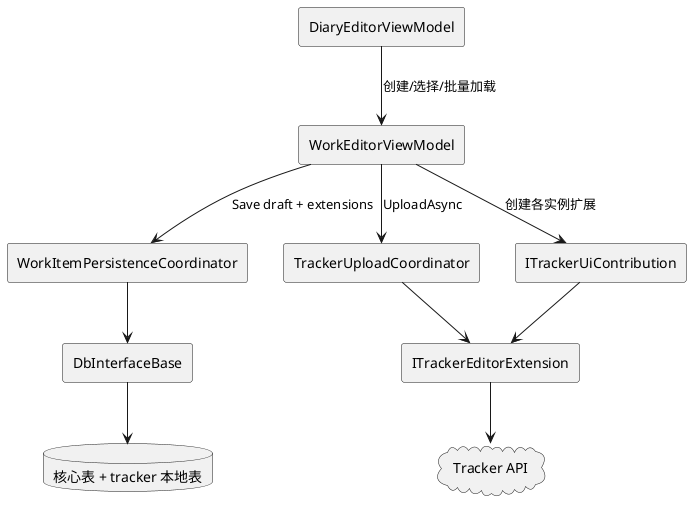
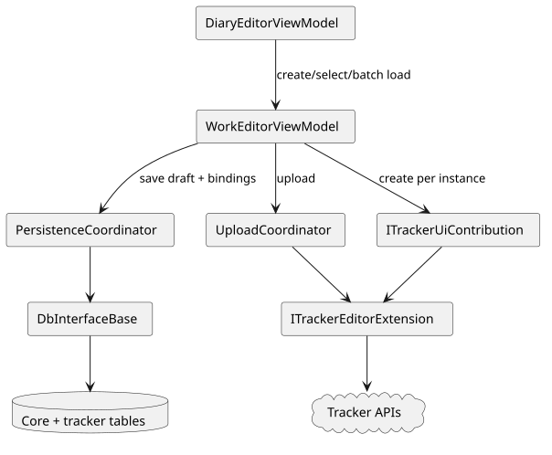
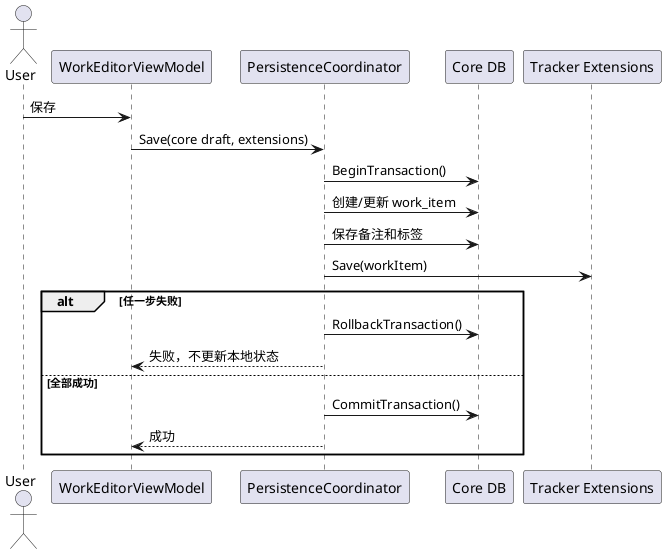
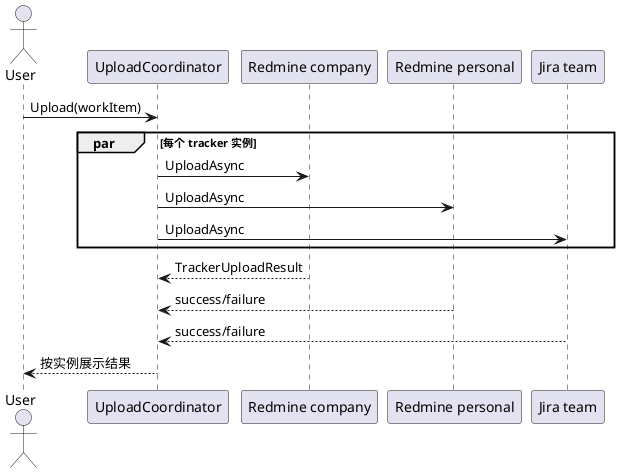

# 多 Tracker 工作项编辑器详细设计

## 1. 目的和范围

本文设计一个核心工作项同时挂载多个 tracker 实例的编辑器流程。

目标：

- 一个工作项可以同时包含 Redmine、Jira 或其他 tracker 的本地绑定。
- 同一种 tracker 可以使用多个实例，例如公司 Redmine 和个人 Redmine。
- 核心字段、tracker 扩展、本地保存和远程上传相互隔离。
- 一个 tracker 失败时不覆盖其他 tracker 的结果，也不丢失核心日记。
- 插件缺失或未配置时，核心编辑器仍然可以创建、编辑和保存工作项。

不在本文范围内：

- 具体 tracker 的远程 API 设计。
- 插件程序集安装器和插件包格式。
- 模板 payload 的具体字段；模板调用边界只定义到接口层。

## 2. 当前实现基线

当前 `WorkEditorViewModel` 已经具备目标能力的主要部分：

- 使用 `ObservableCollection<ITrackerEditorExtension> Extensions`。
- 构造时从 `ITrackerUiContribution` 创建编辑器扩展。
- 支持注入 tracker 注册表和核心默认值，无 tracker 时可以独立创建核心编辑器。
- `SyncFromBatch()` 按实例加载预取的本地绑定。
- `Save()` 遍历扩展保存本地绑定。
- `Upload()` 遍历扩展并聚合成功/失败。
- 日批量上传在核心编辑器层先构造可选记录预览，确认后逐条调用 `Upload()`；失败项可再次提交，结果不确定项不进入自动重试。
- 数据库连接不可用时，核心页面应保留本地数据安全结论，并提供重连、打开数据库配置和导出诊断日志入口；Tracker 实例恢复继续由通用诊断页提供重试。
- 复制昨天只复制核心字段、备注和标签；目标工作项重新创建 Tracker 扩展，不复用源记录的远程 ID、上传状态或锁定状态。
- Tracker 管理导航不写入核心页面枚举，而是继续按已启用实例动态创建；普通用户可隐藏开发者脚本管理页，不影响编辑器脚本动作。
- `IsLocked` 使用任意扩展锁定即锁定核心字段。
- `CanDelete` 使用所有扩展允许删除才允许删除。

以下是早期设计中记录的问题，其中大部分已经在当前实现中解决；剩余改造项见后文路线图：

- 扩展身份已使用 `TrackerKey(PluginId, InstanceId)`，不再只依赖 `InstanceId`。
- `Clone()` 已按 `TrackerKey` 对齐扩展，不依赖集合顺序。
- `Save()` 已通过 `IWorkItemPersistenceCoordinator` 统一处理核心数据和扩展保存事务。
- 绑定预取已使用 `TrackerKey` 作为 key。
- 上传结果已按扩展返回结构化的 `TrackerUploadResult`，并区分成功、失败和结果不确定。
- Jira/Redmine 本地绑定已保存最近一次上传状态、错误文本和尝试时间；远程 ID 仍是成功锁定的依据。
- UI 贡献已通过工厂按实例注册；仍需继续完善更广泛的多实例端到端验收。

## 3. 核心对象模型

### 3.1 稳定身份

所有扩展、绑定和上传结果使用稳定的 tracker key：

```csharp
public readonly record struct TrackerKey(
    string PluginId,
    string InstanceId);
```

规则：

- `PluginId` 标识 tracker 类型，例如 `tracker.redmine`。
- `InstanceId` 标识该 tracker 的配置实例，例如 `redmine.company`。
- `TrackerKey` 是编辑器集合、批量绑定、模板和结果字典的唯一 key。
- 不使用显示名称、集合索引或 UI 顺序作为持久化身份。

### 3.2 编辑器扩展

当前 `ITrackerEditorExtension` 契约为：

```csharp
public interface ITrackerEditorExtension
{
    TrackerKey Key { get; }
    ViewModelBase View { get; }

    void Load(WorkItem? item, object? binding = null);
    bool Save(WorkItem item);
    void CloneTo(ITrackerEditorExtension? target);

    bool IsLocked { get; }
    bool CanDelete { get; }
    TrackerUploadState UploadState { get; }
    string? UploadError { get; }
    DateTimeOffset? UploadAttemptedAt { get; }
    Task<TrackerOperationResult> UploadAsync(WorkItem item);
}
```

`PluginId` 和 `InstanceId` 可以在接口中保留兼容属性，但新代码只使用 `Key` 做匹配。

### 3.3 编辑器会话

核心编辑器维护一个会话对象，避免把持久化流程继续堆在 ViewModel 中：

```csharp
public sealed class WorkEditorSession
{
    public WorkItemDraft Core { get; }
    public IReadOnlyDictionary<TrackerKey, ITrackerEditorExtension> Extensions { get; }
}
```

`WorkEditorViewModel` 负责绑定和交互；`WorkItemPersistenceCoordinator` 负责本地事务；`TrackerUploadCoordinator` 负责远程上传结果。

## 4. 组件关系



图表源文件：`Docs/diagrams/multi-tracker-editor.puml`。



## 5. 扩展创建和加载

### 5.1 创建顺序

1. `DiaryEditorViewModel` 获取当前已启用的 tracker 实例。
2. 每个实例贡献一个 `ITrackerUiContribution` 或由贡献者创建扩展。
3. `WorkEditorViewModel` 按 `TrackerKey` 放入扩展字典。
4. 重复 key 记录错误并跳过，不覆盖已有扩展。
5. 插件未配置时可以不创建扩展，不影响核心编辑器。

### 5.2 已有工作项加载

批量加载使用复合 key：

```csharp
IReadOnlyDictionary<TrackerKey, IReadOnlyDictionary<int, object?>> bindings;
```

流程：

```text
查询当天核心工作项
  -> 查询当天备注和标签
  -> 每个 tracker 实例批量加载本地绑定
  -> 创建 WorkEditorViewModel
  -> 按 TrackerKey 找到对应扩展
  -> 调用 extension.Load(workItem, binding)
  -> 聚合锁定和删除状态
```

没有绑定时必须传 `null`，由扩展清空当前选择；不能保留上一个工作项的 UI 状态。

### 5.3 新工作项加载

新工作项没有数据库 ID：

- 核心字段使用默认值。
- 所有扩展调用 `Load(null, null)` 或等价的清空方法。
- 不创建 tracker 本地绑定。
- 只有核心工作项成功插入并获得 ID 后，才允许扩展保存绑定。

## 6. 本地保存设计

### 6.1 事务边界

本地核心数据和 tracker 绑定属于同一个数据库事务：



### 6.2 保存顺序

```text
校验核心字段和扩展状态
  -> BeginTransaction
  -> 创建或更新 work_items
  -> 保存备注
  -> 保存标签
  -> 按 TrackerKey 顺序保存本地绑定
  -> CommitTransaction
```

当前 `WorkEditorViewModel.Save()` 已通过 `IWorkItemPersistenceCoordinator` 执行上述流程；核心 ViewModel
只接收结果并刷新 `WorkId`、`IsNewItem` 和命令状态。

### 6.3 失败处理

- 核心工作项保存失败：回滚，不调用扩展保存。
- 任一扩展本地保存失败：回滚核心数据和之前扩展的本地保存。
- 回滚失败：记录严重日志，禁止继续覆盖当前编辑器状态。
- 保存失败时保留用户输入，允许重新保存。
- 不在本地事务中调用远程 API。

## 7. 克隆设计

当前按 `TrackerKey` 复制扩展：

```text
创建新的核心工作项草稿
  -> 复制标题、日期、备注、标签和优先级
  -> 目标扩展按 TrackerKey 建立映射
  -> sourceExtension.CloneTo(targetExtension)
  -> 目标 WorkItem 保持未保存状态
```

规则：

- 源和目标都有相同 key 才复制 tracker 状态。
- 目标没有该 key 时跳过，不阻止核心克隆。
- 源有而目标没有时记录 debug 日志。
- 克隆不复制远程 ID、上传状态和锁定状态。
- 克隆后 tracker 本地绑定只有在新工作项保存时创建。

## 8. 锁定、删除和命令状态

### 8.1 锁定

```text
IsLocked = 任意扩展 IsLocked == true
```

锁定时：

- 核心标题、日期、耗时、优先级和备注不可编辑。
- 每个扩展仍可展示自己的远程状态。
- 未配置的 tracker 不参与锁定计算。
- 锁定原因应按 `TrackerKey` 聚合，供 UI 展示。

### 8.2 删除

未上传或确认误写的工作项允许直接删除。已上传工作项删除时，核心编辑器必须明确提示本地删除不会删除远程工时；上传结果不确定时，应先提示查询或重试。

删除核心工作项后依赖外键清理本地绑定；如果某 tracker 使用非级联表，必须由协调器显式调用清理方法。`ITrackerEditorExtension.CanDelete` 只表示扩展是否允许无确认删除，不能作为核心本地删除的全局否决条件。

### 8.3 命令刷新

扩展状态变化后，编辑器必须刷新：

- 保存命令
- 删除命令
- 上传当前工作项命令
- 克隆命令

不能依赖 UI 层手动 `NotifyCanExecuteChanged()` 作为唯一刷新路径。

## 9. 远程上传设计

### 9.1 结果模型

扩展的 `UploadAsync()` 仍返回单次 `TrackerOperationResult`；`TrackerUploadCoordinator`
负责按实例聚合为以下结果模型：

```csharp
public sealed record TrackerUploadResult(
    TrackerKey Key,
    bool Success,
    bool Skipped,
    string? Error,
    string? RemoteId);
```

聚合结果：

```csharp
public sealed record WorkUploadResult(
    IReadOnlyList<TrackerUploadResult> Results)
{
    public bool Success => Results.Count > 0 && Results.All(x => x.Success || x.Skipped);
}
```

### 9.2 上传流程



是否并行：第一版建议顺序执行，减少数据库和 UI 状态竞争；接口保留独立结果，后续可在确认线程安全后并行。

规则：

- 上传前确保核心工作项已保存。
- 一个实例失败不短路其他实例。
- 已锁定或未配置实例返回 `Skipped`。
- 上传不回滚本地保存。
- 成功或失败状态按 key 写入 UI，不使用拼接字符串作为唯一状态。
- 重试只执行失败或可重试的实例。

## 10. UI 结构

编辑器 UI 分成核心区和扩展区：

```text
WorkEditor
  ├── 核心字段区
  ├── 标签和备注区
  ├── Tracker 扩展区
  │   └── TabControl
  │       ├── Redmine / 公司实例
  │       ├── Redmine / 个人实例
  │       └── Jira / 团队实例
  └── 操作状态区
      ├── 本地保存状态
      ├── 各实例上传状态
      └── 锁定原因
```

扩展区使用顶部 Tab 展示，每个 Tab 对应一个已启用的 tracker 实例。Tab 标题使用实例的 `DisplayName`，为空时回退到 `InstanceId`，鼠标提示显示 `PluginId/InstanceId`；Tracker 设置保存并完成实例重注册后，已有日记编辑器应刷新 Tab 标题；内部操作必须使用 `TrackerKey`。UI 顺序可以由插件注册顺序或配置排序决定，但不能影响数据匹配。

## 11. 接口改造策略

以下顺序记录已落地的接口改造和仍需补强的验收工作：

### 第一步：身份改造

- [x] 新增 `TrackerKey`。
- [x] 给 `ITrackerEditorExtension` 增加 `Key`。
- [x] `ITrackerUiContribution` 的实例和扩展校验 `PluginId + InstanceId` 一致。
- [x] 将 `bindingsByTracker` 改为 `TrackerKey` key。

### 第二步：提取保存协调器

- [x] 新增 `IWorkItemPersistenceCoordinator`。
- [x] 将 `WorkEditorViewModel.Save()` 中核心保存、备注、标签和扩展保存移入协调器。
- [x] 由 provider 的 `BeginTransaction/CommitTransaction/RollbackTransaction` 控制事务。
- [x] 保持现有 `Save(out bool created)` 作为 ViewModel 兼容入口。

### 第三步：提取上传协调器

- [x] 新增 `ITrackerUploadCoordinator`。
- [x] 将当前 `Upload()` 的遍历逻辑移入协调器。
- [x] 返回结构化的按实例结果。
- [~] UI 已保留按实例结果集合，按实例状态展示和失败重试入口仍需继续补强。

### 第四步：按 key 克隆和状态聚合

- [x] 删除按索引 `CloneTo`，改为按 `TrackerKey` 克隆。
- [~] 上传状态集合已接入；锁定原因和统一命令刷新仍需继续补强。

### 第五步：多实例 UI

- [x] 让每个已启用实例创建独立 `ITrackerUiContribution`。
- [~] Redmine manifest 已开启多实例；UI、数据库和模板当前均按 `TrackerKey` 工作，仍需继续补充多实例端到端验收。

## 12. 测试设计

### 单元测试

- 两个不同插件实例可以创建两个扩展。
- 同一个插件两个实例 key 不冲突。
- 相同 key 不会重复创建或覆盖。
- 按 key 加载绑定，不依赖集合顺序。
- 按 key 克隆扩展，顺序变化不影响结果。
- 任意扩展锁定时核心锁定。
- 未上传工作项可以删除，已上传工作项删除时会显示远程影响确认。
- 缺失扩展时核心克隆和保存仍成功。
- 无 tracker 时核心编辑器可以创建，模板可以创建、加载和保存核心字段。

### 本地事务测试

- 核心保存失败时不调用扩展保存。
- 第一个扩展保存成功、第二个失败时整体回滚。
- 提交成功后所有绑定可读取。
- 新工作项只有核心插入成功后才创建扩展绑定。

### 上传测试

- 一个 tracker 失败不影响其他 tracker 上传。
- 上传结果按 `TrackerKey` 返回。
- 已锁定和未配置 tracker 被跳过。
- 只重试失败实例。
- 远程失败不回滚本地保存。

### 集成测试

- Redmine 公司实例和 Redmine 个人实例同时显示并隔离数据。
- Redmine 和内存 tracker 同时编辑、保存和克隆。
- 移除所有 tracker 程序集后核心编辑器仍可用。

## 13. 非目标和风险

- 第一版不强制所有 tracker 并行上传。
- 第一版不把远程 API 放入数据库事务。
- 第一版不改变现有核心工作项数据库 schema。
- 如果扩展内部保存依赖多个数据库连接，需要先统一使用宿主连接和当前事务。
- 如果插件 UI 贡献仍是 singleton，必须在多实例完成前改为按实例创建，不能共享可变选择状态。

## 14. 完成标准

阶段完成后必须满足：

- `WorkEditorViewModel` 不直接实现数据库事务细节。
- 所有 tracker 扩展以 `TrackerKey` 识别。
- 核心工作项和本地 tracker 绑定具备原子保存语义。
- 上传结果可以按实例独立展示和重试。
- 克隆、锁定、删除和模板应用不依赖扩展集合顺序。
- 无 tracker、单 tracker、多 tracker 和多实例场景均有自动化测试。
