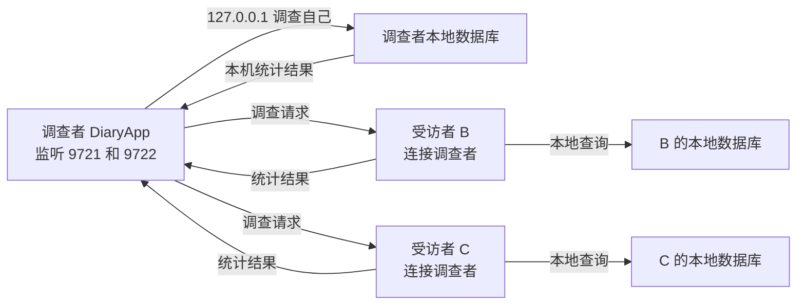
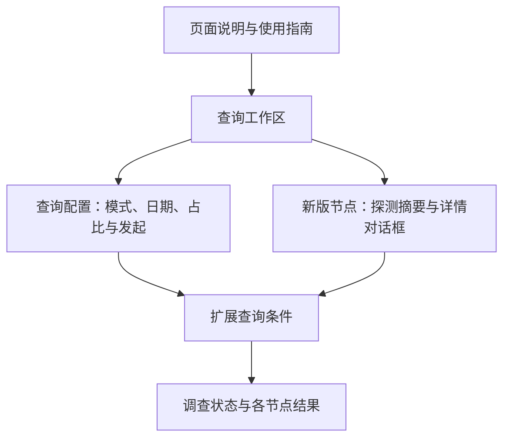

# 调查功能使用指南

> 本文面向使用 DiaryApp 调查功能的普通用户和测试人员。
> 如果需要了解 v1/v2 报文、端口常量和实现边界，请阅读 [Survey 协议扩展设计](SurveyProtocolDesign.md)。

## 1. 调查功能是什么

调查功能用于从局域网中多台正在运行的 DiaryApp 或旧版 DiaryToolpp 收集工时统计。

- **调查者**选择查询条件、发起调查并汇总结果。
- **受访者**收到请求后，在自己的本地数据库中执行查询并返回统计结果。
- 调查者不会直接连接或操作受访者的数据库，也不会向受访者发送 SQL。
- 调查者也会通过本机回环地址调查自己的数据库，因此结果通常包含调查者本机。

这里的“调查”指跨设备工时统计，不是问卷功能。

## 2. 一分钟快速开始

以下示例使用两台电脑：A 是调查者，B 是受访者。

### 2.1 配置调查者 A

打开程序设置中的“调查统计功能设置”：

```text
启用调查功能：打开
作为调查者：打开
调查者 IP 地址：留空
```

保存后，主导航栏会出现“调查”页面。调查者监听固定端口 `9721` 和 `9722`。

### 2.2 配置受访者 B

```text
启用调查功能：打开
作为调查者：关闭
调查者 IP 地址：填写 A 的局域网 IP
```

例如调查者地址是 `192.168.1.20`，受访者只填写 IP，不填写端口：

```text
192.168.1.20
```

保存后，受访者会在后台连接调查者，不需要打开调查页面。

### 2.3 发起第一次调查

在调查者电脑上：

1. 打开“调查”页面；
2. 查询模式保持“兼容查询（v1）”；
3. 选择开始和结束日期；
4. 点击“发起调查”；
5. 等待主要响应窗口结束；
6. 在页面下方查看每个 `用户名@主机名` 的结果。

第一次测试不要使用关键词、标签、优先级或结果明细，以便先确认 v1 连接正常。

## 3. 角色和网络拓扑



需要注意：

1. 只有调查者监听端口，普通受访者主动连接调查者；
2. “调查者 IP 地址”只需要在受访者上填写；
3. 调查者同时承担受访者职责，会返回自己的统计结果；
4. 调查页面只在启用“作为调查者”后显示。

## 4. 页面区域导览

调查页按任务分成顶部入口、全宽查询配置、扩展条件和结果区；查询配置使用三行紧凑布局，不再把所有控件连续堆叠在左上角。新版节点能力属于辅助信息：首页只显示探测状态和操作按钮，完整能力在独立对话框中查看，不占用调查结果空间：



| 页面控件 | 用途 | 是否仅适用于 v2 | 注意事项 |
| --- | --- | --- | --- |
| 查询模式 | 明确选择兼容查询或扩展查询 | 否 | 默认使用兼容查询 |
| 时间范围 | 限制工作记录日期 | 否 | 开始日期不能晚于结束日期；无效时禁止发起调查 |
| 发起调查 | 清空上一轮结果并发送请求 | 否 | 主要响应窗口约 3 秒 |
| 占比计算基准 | 修改结果中占比的计算分母 | 否 | 不改变节点返回的实际总耗时 |
| 重新计算 | 使用当前结果重新计算百分比 | 否 | 不会重新发送网络请求 |
| 探测新版节点 | 查询支持 v2 的节点能力 | 是 | 旧版节点不会出现在探测结果中 |
| 查看详情 | 在独立对话框中查看节点的查询、分组和明细能力 | 是 | 发现至少一个新版节点后才可使用 |
| 关键词 | 匹配事项标题或备注 | 是 | 不区分大小写 |
| 标签名 | 按受访者本地标签名筛选 | 是 | 多个标签可用中英文逗号或分号分隔 |
| 标签模式 | 控制标签集合如何匹配 | 是 | “忽略标签”不会使用已填写的标签名 |
| 优先级 | 只查询指定优先级 | 是 | 是精确匹配，不是“以上”或“以下” |
| 分组维度 | 按标签、日期或优先级汇总 | 是 | 改变结果组织方式，不是额外筛选条件 |
| 返回结果明细 | 返回具体工作记录 | 是 | 每个节点最多返回 500 条 |

## 5. 两种查询模式

### 5.1 兼容查询（v1）

兼容查询固定使用 TCP `9721`，只发送日期范围：

```text
yyyy-MM-dd:yyyy-MM-dd
```

特点：

- 支持旧版 DiaryToolpp 和新版 DiaryApp；
- 只按日期查询；
- 结果默认按标签汇总；
- 适合日常统计和新旧版本兼容测试。

如果只是想知道各台电脑某段时间的工时分布，优先使用兼容查询。

### 5.2 扩展查询（v2）

扩展查询固定使用 TCP `9722`。

特点：

- 仅支持新版 DiaryApp；
- 支持关键词、标签模式和优先级筛选；
- 支持按标签、日期或优先级分组；
- 可以返回最多 500 条工作记录明细。

页面通过“查询模式”显式决定使用 v1 还是 v2。选择兼容查询时，扩展查询区域会隐藏且不会参与请求；选择扩展查询后，该区域才会显示并允许配置扩展条件。

## 6. 探测新版节点

“探测新版节点”向 `9722` 发送能力请求，用于确认当前哪些连接支持扩展查询。

探测完成后点击“查看详情”，对话框会显示：

- 节点名称，即 `用户名@主机名`；
- 支持的查询类型；
- 支持的分组维度；
- 是否支持返回结果明细。

能力探测：

- 不访问节点数据库；
- 不是发起调查的必需步骤；
- 不会显示只支持 v1 的旧版节点；
- 等待窗口约 1.5 秒。

因此，“未发现支持 v2 的节点”不代表旧版节点没有连接，也不代表兼容查询一定失败。

## 7. 扩展查询字段

### 7.1 关键词

关键词匹配工作事项标题/备注以及工作记录 Note 内容，采用不区分大小写的包含匹配。

例如输入：

```text
调查协议
```

会查找内容中包含“调查协议”的工作记录。

### 7.2 标签名

多个标签可以使用以下分隔符：

```text
项目A,紧急
项目A，紧急
项目A;紧急
项目A；紧急
```

每个受访者会在自己的数据库中按名称解析标签，因此不同电脑上的标签名称应保持一致。调查者不会把自己的标签 ID 发送给受访者。

### 7.3 标签模式

| 标签模式 | 含义 | 示例 |
| --- | --- | --- |
| 忽略标签 | 完全不使用标签筛选 | 即使填写标签名，也不会按标签过滤 |
| 任意标签 | 包含任意一个指定标签 | `项目A,项目B` 表示包含 A 或 B |
| 全部标签 | 包含所有指定标签，允许有额外标签 | 包含 A 和 B，也可以同时包含 C |
| 无标签 | 工作记录没有任何标签 | 填写的标签名不参与查询 |
| 精确匹配 | 标签集合完全一致，不能多也不能少 | 指定 A、B 时，额外包含 C 的记录不匹配 |

注意：

- “任意标签”和“全部标签”至少需要一个在受访者数据库中存在的标签；
- 标签不存在时，节点可能返回查询错误；
- “精确匹配”解析不到任何指定标签时，可能等价于查询无标签记录，应先通过一致的标签命名避免这种歧义。

### 7.4 优先级

默认值“全部优先级”不进行优先级筛选。选择 `P0`、`P1` 等值后，只返回该优先级的记录。

### 7.5 分组维度

分组维度决定汇总树如何组织：

- **标签**：按一级标签和二级标签显示；
- **日期**：按工作记录日期显示；
- **优先级**：按 `P0`、`P1` 等优先级显示。

分组不会额外过滤记录。例如选择“按日期分组”不会只查询某一天，实际日期范围仍由顶部开始和结束日期决定。

### 7.6 返回结果明细

勾选后，每个节点会额外返回具体记录的：

- 日期；
- 标题或备注；
- 工时；
- 优先级；
- 标签。

每个节点最多返回 500 条明细。超过限制时，页面会显示结果已截断。不需要查看具体工作内容时，建议关闭该选项。

## 8. 占比计算基准

“占比计算基准”只改变标签或分组项的百分比计算分母，不会修改节点返回的实际总耗时，也不会重新查询数据库。

默认值为 `0` 时，使用每个节点自己的总耗时：

```text
节点总耗时：10 小时
开发：4 小时
开发占比：4 / 10 = 40%
```

设置为 `8` 小时后：

```text
开发：4 小时
开发占比：4 / 8 = 50%
```

“重新计算”只对当前页面中已经收到的结果重新计算百分比。

## 9. 调查结果

每个结果卡片对应一个节点，标题格式为：

```text
用户名@主机名
```

结果包括：

- 查询日期范围；
- 节点返回的总耗时；
- 汇总方式；
- 可选的记录明细；
- 标签、日期或优先级汇总树；
- 各项工时及占比。

相同的 `用户名@主机名` 被视为同一个节点；同一轮调查中收到相同节点的多次结果时，后到结果会覆盖先到结果。

每次点击“发起调查”都会清空上一轮结果。

## 10. 常见使用场景

### 10.1 查询所有节点本周工时

```text
查询模式：兼容查询（v1）
时间范围：本周
其他条件：不需要
```

结果：旧版和新版节点都可以返回按标签汇总的数据。

### 10.2 查询新版节点中与“调查协议”相关的记录

```text
查询模式：扩展查询（v2）
时间范围：本月
关键词：调查协议
分组维度：日期
返回结果明细：打开
```

结果：仅新版节点响应，结果按日期汇总，并包含具体记录。

### 10.3 查询同时包含两个标签的记录

```text
查询模式：扩展查询（v2）
标签名：项目A,紧急
标签模式：全部标签
分组维度：标签
```

结果：返回同时包含“项目A”和“紧急”的记录，允许记录还有其他标签。

### 10.4 查询完全没有标签的记录

```text
查询模式：扩展查询（v2）
标签模式：无标签
标签名：留空
```

结果：只返回没有任何标签的工作记录。

## 11. 新旧版本兼容性

| 调查者 | 受访者 | 查询类型 | 是否支持 |
| --- | --- | --- | --- |
| 新版 | 旧版 | 兼容查询 v1 | 支持 |
| 新版 | 新版 | 兼容查询 v1 | 支持 |
| 新版 | 新版 | 扩展查询 v2 | 支持 |
| 新版 | 旧版 | 扩展查询 v2 | 旧版不会响应 |
| 旧版 | 新版 | 旧版日期查询 | 支持 |
| 旧版 | 旧版 | 旧版日期查询 | 支持 |

旧版节点不支持能力探测，因此不会出现在“新版节点能力”详情对话框中。

## 12. 等待时间和状态提示

日期范围有效时，点击“发起调查”后，页面会进入约 3 秒的主要响应窗口。状态区域会显示当前收到的节点数量和节点返回的错误。开始日期晚于结束日期时，页面会直接显示本地校验提示并禁用“发起调查”，不会清空上一轮结果，也不会向任何节点发送请求。

主要响应窗口结束不代表所有网络连接都被强制关闭。较慢的节点如果随后返回，结果仍可能继续出现在页面中。

“探测新版节点”的主要等待窗口约为 1.5 秒。

## 13. 故障排查

### 13.1 调查页面没有出现

检查：

1. “启用调查功能”是否打开；
2. “作为调查者”是否打开；
3. 配置是否已经保存；
4. 主导航栏是否在保存后完成刷新。

普通受访者不会显示调查页面，这是预期行为。

### 13.2 未发现支持 v2 的节点

可能原因：

- 当前只有旧版受访者；
- 受访者没有启用调查功能；
- 受访者填写了错误的调查者 IP；
- 调查者或受访者的防火墙阻止了 TCP `9722`；
- 受访者尚未完成连接。

先尝试兼容查询。如果兼容查询正常但能力探测失败，应重点检查版本和 `9722`。

### 13.3 兼容查询没有结果

检查：

- 受访者是否填写了正确的调查者 IP；
- TCP `9721` 是否可达；
- 受访者数据库是否正常连接；
- 日期范围内是否有工作记录；
- 调查者和受访者是否都启用了调查功能。

### 13.4 能探测到节点，但扩展查询没有结果

检查：

- 查询模式是否为“扩展查询（v2）”；
- 日期范围内是否有匹配数据；
- 标签名称是否存在于受访者数据库；
- “任意标签”或“全部标签”是否填写了有效标签名；
- 页面状态区域是否显示节点返回的错误。

### 13.5 旧版节点没有出现在节点详情中

这是预期行为。旧版 DiaryToolpp 只支持 v1/`9721`，能力探测使用 v2/`9722`。使用兼容查询验证旧版节点。

### 13.6 查看日志

在程序设置中点击“打开当前日志”，可以搜索：

```text
Respondent connecting
Respondent received
Respondent sent
Surveyor receive failed
扩展调查失败
数据库不可用
```

日志可以帮助区分：

- 尚未建立连接；
- 已收到请求但处理失败；
- 已生成结果但发送失败；
- 数据库不可用；
- 查询条件无效。

## 14. 防火墙和网络

调查功能使用固定 TCP 端口：

| 端口 | 协议 | 用途 |
| --- | --- | --- |
| `9721` | v1 | 兼容日期查询 |
| `9722` | v2 | 能力发现和扩展查询 |

调查者需要允许这两个端口的入站连接。受访者需要能够访问调查者的局域网 IP。

不要在“调查者 IP 地址”中填写：

- `http://` 或 `tcp://` 前缀；
- 端口号；
- 受访者自己的 IP。

## 15. 数据和隐私边界

- 查询在受访者本地执行；
- 调查者不会直接访问受访者数据库；
- v1 汇总结果包含用户名、主机名、日期、工时和标签统计；
- v2 可以额外包含记录数量、分组结果和工作记录明细；
- 打开“返回结果明细”后，结果可能包含工作事项标题、备注、优先级和标签；
- 不需要查看具体内容时，建议关闭结果明细；
- 调查功能适合可信局域网，不应直接暴露到不受信任的公网。

## 16. 给测试人员的最小验收清单

- [ ] 新版调查者可以通过兼容查询收到自己的结果；
- [ ] 新版调查者可以通过兼容查询收到旧版受访者结果；
- [ ] 旧版调查者可以收到新版受访者结果；
- [ ] “探测新版节点”只列出新版节点；
- [ ] 扩展查询只收到新版节点结果；
- [ ] 标签、日期和优先级分组结果正确；
- [ ] 开始日期晚于结束日期时按钮禁用、显示本地提示且不发送调查请求；
- [ ] 结果明细超过 500 条时显示截断；
- [ ] 节点错误会显示在调查页面状态区域；
- [ ] 调查结果较多时可以垂直滚动查看；
- [ ] 程序设置中的“打开当前日志”可以用于调查故障诊断。
