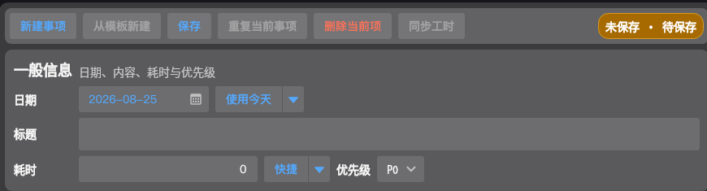
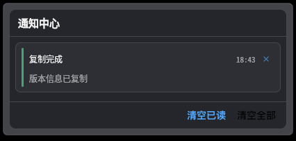
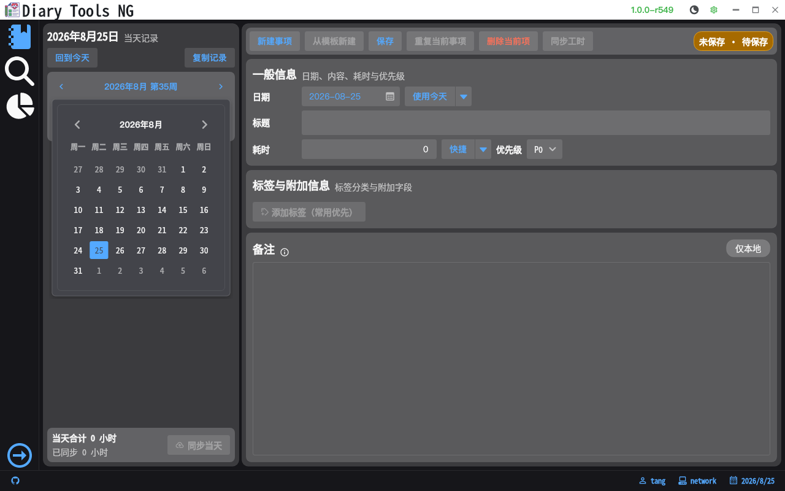
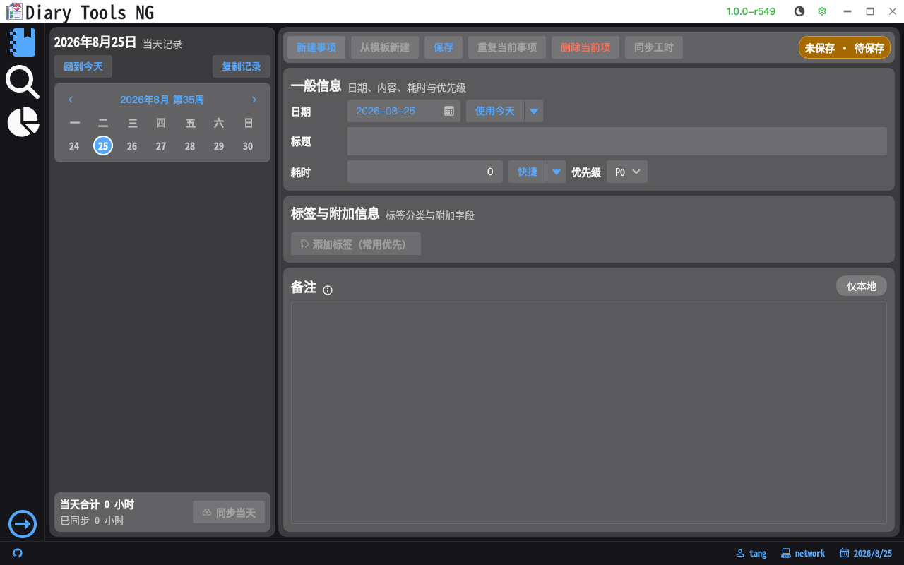
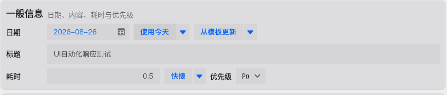
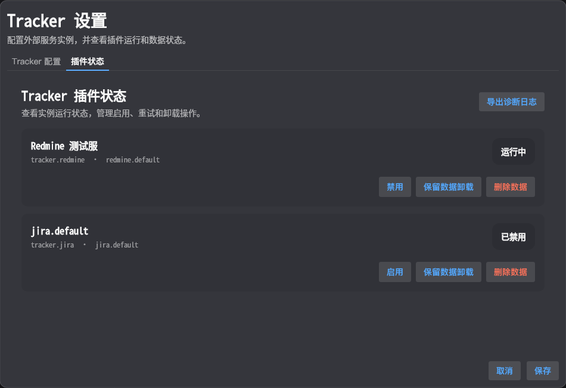
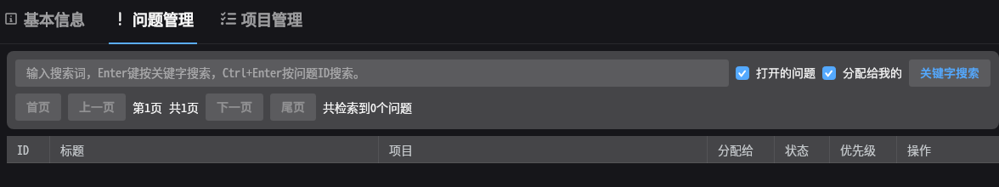
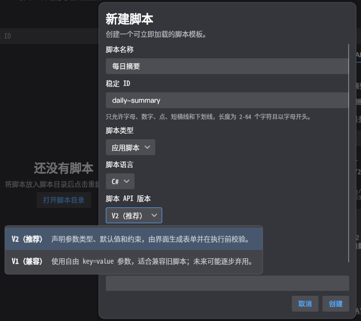
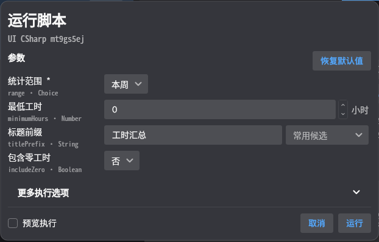

# 关于本手册

本手册面向 DiaryApp 的最终用户，说明如何完成首次配置、记录日常工作、查询和统计历史事项，以及按需使用 Tracker、调查、脚本和数据维护功能。

本版手册适用于数据版本 `1.0.1`，按 2026-08-26 的 `main` 分支功能编写。应用右上角显示的 `rN` 是构建序号，可能随修复和发布继续增加，不影响本手册描述的基本操作。Linux 版与 Windows 版的功能和操作逻辑相同，但标题栏、系统托盘、文件选择器和字体呈现可能略有差异。部分页面只会在对应功能、插件或开发者选项启用后出现。

> **截图说明：** 日记页截图来自 Linux X11 隔离测试 profile；查询和统计等截图的原始采集环境为 Windows 150% DPI；程序设置、标签、模板、Tracker/Redmine、“AI 与 MCP”、“AI 上下文”和脚本创建向导截图来自隔离测试 profile。Windows 自动化对普通窗口使用真实窗口表面，对完整月历等弹层使用 CDP 合成表面，再按当前窗口的实际缩放倍率归一化为逻辑 1×/96 DPI；高 DPI 物理原图只用于裁切和缩放复核。截图可能使用明色或暗色主题，并裁剪为主要功能区域；用户名、计算机名、绝对路径、服务地址、凭据和真实用户数据未包含在手册素材中。

# 安装与启动

## 选择安装包

从项目发布位置下载与操作系统匹配的压缩包：

- Windows 使用 `win-x64` 包；
- Linux 使用 `linux-x64` 包；
- 只使用常规功能或 C#/Lua 脚本时，选择标准包；
- 需要直接运行 Python 脚本、且电脑上没有合适 Python 环境时，选择带 Python 运行时的包。

带 Python 运行时的包只保证 DiaryApp 自带脚本示例和受支持的 Python Host 能运行，不等同于通用 Python 开发环境。程序不承诺提供 `pip`，也不支持脚本任意安装或导入第三方包；需要额外依赖时，应先确认当前脚本安全模型和运行时是否明确允许。

下载后把整个压缩包解压到固定目录，不要直接在压缩软件中运行程序。更新或迁移前，建议先关闭正在运行的 DiaryApp。

正式发布包还会在 `Docs/UserManual/` 中携带本手册的 HTML 和 PDF。请保留完整解压后的目录结构；如果只复制可执行文件，程序内的用户手册入口会自动隐藏。

## 启动程序

Windows 双击 `Diary.App.exe`。Linux 在解压目录中启动 `Diary.App`；如果系统清除了可执行权限，需要先恢复该文件的执行权限。

程序默认使用本地 SQLite 数据库，适合单机使用，不要求另行安装数据库服务。需要集中存储或多环境管理时，可在程序设置中切换 PostgreSQL。

# 首次使用

首次启动会显示引导页，介绍本地保存、远程同步和日常效率三个基本概念。

{#fig-onboarding width=100%}

可根据需要选择：

- **开始记录**：使用当前数据库配置进入日记页；
- **打开数据库设置**：检查 SQLite 文件位置，或配置 PostgreSQL；
- **稍后再看**：关闭引导，但下次仍可继续显示；
- **以后不再显示此引导**：保存不再自动弹出的选择。

以后需要重新查看时，打开“设置菜单 → 程序设置 → 视图设置”，使用重新打开引导的操作项。

## 五分钟开始记录

首次使用可以按下面的最短流程操作：

1. 保持默认 SQLite 数据库，完成首次使用引导；
2. 打开“设置菜单 → 标签设置”，至少建立一个项目或工作类型标签；
3. 回到“日记记录”，点击“新建事项”，填写标题、耗时并添加标签；
4. 点击“保存”，确认右上角状态包含“本地已保存”；
5. 需要远程报工时，再配置 Tracker、选择 Issue/活动并执行同步。

只在本地记录时，不需要配置 Tracker。建议先建立稳定的标签体系，再逐步启用模板、附加字段、Tracker 和脚本。

## 先理解两种保存状态

DiaryApp 把本地记录和远程 Tracker 写入分开处理：

1. 工作事项先保存到 DiaryApp 数据库；
2. 配置了 Jira、Redmine 等 Tracker 后，再由用户主动同步远程工时；
3. Tracker 暂时不可用时，本地事项仍然保留，不需要重新录入；
4. 已成功上传或结果不确定的记录不会自动重复提交。

看到“本地已保存”表示内容已经进入本地数据库；它不等于已同步到 Tracker。

编辑器右上角的状态胶囊会组合显示本地保存和 Tracker 同步状态：未保存使用琥珀色、待同步使用蓝色、已同步使用绿色、同步失败使用红色、结果待确认使用橙色；没有配置 Tracker 或查看迁移只读记录时保持中性色。颜色用于帮助快速识别，最终仍应以状态文字为准。

{#fig-status-pill width=100%}

图中右上角“未保存 · 待保存”表示当前输入尚未写入本地数据库。保存后第一段会变为“本地已保存”；配置 Tracker 后，第二段继续显示待同步、已同步、失败或结果待确认。顶部按钮会随状态启用或禁用，例如没有可同步的 Tracker 信息时“同步工时”不可用。

{#fig-save-sync-flow width=100%}

> **判断原则：** “本地已保存”是数据安全的第一道确认；只有 Tracker 显示成功状态，才表示远程系统已经确认接收。出现“结果不确定”时先远程核对，避免重复提交。

# 主界面导览

左侧是主导航，顶部是当前页面操作区，底部显示日期、用户和后台状态。导航栏可展开或折叠。

固定页面包括：

| 页面 | 用途 |
|---|---|
| 日记记录 | 按天新建、修改、复制和同步工作事项 |
| 事项查询 | 按日期、关键词、标签和优先级检索历史记录 |
| 统计工具 | 按周、月、季度、年度或自定义范围汇总工时 |

按配置还可能显示调查工具、脚本管理和 Tracker 管理页。`Alt+1`、`Alt+2` 等快捷键按当前导航顺序切换页面。

标题栏右侧依次提供版本号、主题切换和设置菜单。点击版本号可立即检查更新，也可复制简短版本号或完整构建信息。应用图标菜单中包含关于、最大化、最小化、重启和退出。正式发布版且手册文件完整时，菜单还会显示“用户手册”：优先使用系统默认浏览器打开 HTML，HTML 缺失时回退到 PDF。开发调试构建不携带该入口和文件。

窗口底部状态栏集中显示数据库、Tracker、后台任务、更新状态和当前日期。日期左侧的铃铛用于打开通知中心；有未读通知时会显示数量，并按当前最高级别使用信息、成功、警告或错误色。打开面板后，原有通知会标记为已读；面板打开期间新到达的通知仍保持未读。

{#fig-notification-center width=48%}

通知中心最多显示最近 100 条、30 天内的记录。短时间重复的相同通知会合并并显示次数；可单条删除、清空已读或确认后清空全部。复制提示、参数校验等低价值即时提示通常不会进入历史；普通操作结果只在本次运行保留，数据库、Tracker、更新、备份还原和脚本异常等需要后续处理的通知可在重启后继续查看。适用的通知还会提供数据库设置、Tracker 设置、检查更新、打开日志或打开本地文件等操作。

# 记录每天的工作

## 查看某一天

日记页左侧固定显示一周。中间按钮以 `年月 第X周` 显示当前浏览周期，例如 `2026年8月 第35周`，其中周次为年度周次。点击日期选择当天记录；点击左右箭头、按 PageUp/PageDown，或把鼠标停在周历上滚动，可逐周浏览而不改变当前选中的日记日期，年月和周次会同步更新。左键点击该按钮会打开完整月历，便于选择日期和跨月、年月定位；完整月历本身不提供右键操作。今天以圆形浅色强调底和描边标记，当前选中日期使用圆形主色高亮背景，鼠标悬停和按下反馈也保持圆形，两者可以同时出现。右键紧凑日期会先选中目标日期，再打开单日、本周、上周的同步、统计、调查和脚本操作；右键年月周次按钮可打开本月、本季度、本年度的统计、调查和脚本操作。脚本操作与前面的内置操作之间使用分隔线；对应范围没有可运行脚本时，子菜单显示禁用的“暂无”。点击“回到今天”或按 `Ctrl+T` 可立即恢复当天和当前周。

{#fig-diary-full-calendar width=100%}

完整月历的使用要点：

- 顶部月份和年份可继续进入年月选择；每次重新展开都会回到当前选中日期所在月份的月视图；
- 点击日期后会立即选中并关闭弹层；点击相邻月份显示的日期会精确跳到该日期，不会额外多翻一个月；
- 月历用于选日期，周/月/季度/年度操作仍从紧凑周历和年月周次按钮的右键菜单进入。

日期下方列出当天全部事项，并显示标题、优先级、耗时、本地保存状态和 Tracker 状态。底部显示当天总工时和已提交工时。

{#fig-diary-overview width=100%}

阅读日记页时可以按“左侧日期与事项列表 → 右侧当前事项编辑器 → 左下角当天汇总”的顺序检查。事项较多时，先通过列表中的状态文字定位未保存、待同步或失败记录，再在右侧查看具体字段和 Tracker 关联。

## 同步本周或本月工时

右键紧凑日期可执行“同步本周工时”，右键年月周次按钮可执行“同步本月工时”。快捷同步会先自动保存当前有内容的事项；保存失败时不会开始远程操作。程序随后按日期顺序检查范围内的记录，只提交工时大于 0、Tracker 必填信息完整且尚未同步的普通事项；迁移导入、已同步、同步中或结果待确认、0 工时、未配置 Tracker、绑定缺失或绑定值失效的事项会直接跳过。

同步期间会显示当前事项、处理进度及成功/跳过数量。遇到第一个 Tracker 或事项同步失败时，程序立即停止，不再提交后续记录。结束明细会显示成功、跳过、失败和未处理数量，并按原因汇总跳过项；如果失败，还会给出失败日期、事项 ID、标题和 Tracker 返回的错误。已经成功提交到远程的工时不会因后续失败自动回滚。

## 新建事项

点击“新建事项”或按 `Ctrl+N`，然后填写：

1. **日期**：可直接选日期，也可使用今天、昨天、明天快捷项；日期、标题和耗时输入框按同一左边缘排列；
2. **标题**：简要描述完成的工作；
3. **耗时**：在同一输入框中填写 `1.5`、`30m`、`1h30m` 或 `1小时30分钟`；按 `Enter` 或移开焦点应用，按 `Esc` 恢复最近一次有效值；
4. **优先级**：按团队习惯选择；
5. **标签**：用于项目、工作类型或统计归类；
6. **备注**：仅保存在本地，可记录不适合发送到远程 Tracker 的补充信息。

备注编辑框会自动占满事项编辑区的剩余高度，窗口变高时可直接获得更大的多行输入区域。没有启用且可用的 Tracker 实例时，事项编辑器不会显示空的“Tracker 关联”区块，备注区域会使用释放出的空间。

{#fig-diary-editor width=100%}

填写时先确认日期，再填写便于检索的标题、耗时和优先级；按需添加项目、客户或工作类型标签，保存后检查本地保存状态。

点击“保存”或按 `Ctrl+S`。在切换日期、页面、新建下一项或应用模板时，有内容的草稿也会先尝试保存，以减少误操作造成的数据丢失。

## 只读事项和锁定状态

事项是否可编辑取决于来源和同步状态：

| 状态 | 可查看 | 可修改 | 可再次同步 |
|---|---|---|---|
| 普通未同步事项 | 全部本地内容和 Tracker 关联 | 可以 | Tracker 信息完整且工时大于 0 时可以 |
| 已同步普通事项 | 本地内容、Tracker 关联和附加字段 | 点击“修改”后可修改除日期外的本地数据；Tracker 关联始终只读 | 不会自动重复提交 |
| 结果待确认或部分已提交 | 本地内容和已有 Tracker 关联 | 存在已提交 Tracker 时可点击“修改”编辑本地数据；日期和全部 Tracker 关联只读 | 先到远程系统核对，不要直接重试 |
| 迁移导入事项 | 旧数据中的本地内容 | 不可以；不显示附加信息入口 | 不可以 |

已提交事项默认锁定。点击顶部“修改”后，状态摘要会显示“本地修改中”，此时可以修改标题、耗时、优先级、备注、标签、附加字段或应用模板；日期选择和全部 Tracker 页签始终禁用。点击“保存”后只更新本地数据并恢复锁定，不会更新远程工时或 Tracker 绑定。复制已提交事项会创建新的本地事项，但不会复制原 Tracker 绑定和上传状态。

## 快速填写工时

耗时输入框同时接受数字小时和自然时间表达式；右侧快捷菜单可直接选择 15 分钟、30 分钟、1 小时、2 小时、4 小时、8 小时或清零。自然时间表达式适合从会议记录或任务清单中快速录入。

## 重复和复制事项

- **重复当前事项**（`Ctrl+D`）：在当前日期复制所选事项；
- **复制昨天**：复制上一天的本地事项；
- **复制最近**：在当前日期之前近一年内查找最近一条记录并复制；
- **复制整天**：选择源日期，把那一天的全部事项复制到当前日期。

{#fig-copy-day width=100%}

复制操作会保留标题、工时、优先级、标签、备注和附加字段，但不会复制 Jira、Redmine 等远程 Tracker 绑定或上传状态，也不会因为原事项的标签规则自动派生出远程绑定。复制后请检查目标日期、标签默认值和 Tracker 区域。

## 删除事项

选中事项后点击“删除当前项”或按 `Ctrl+Shift+D`，并在确认对话框中确认。

> 删除本地事项不会删除已经写入 Jira、Redmine 等远程系统的工时。远程记录需要按对应系统的流程单独处理。

# 使用标签和附加字段

## 标签的作用

标签可表示项目、客户、工作类型、成本中心等分类。统计页以主标签为主要汇总维度，次标签用于进一步细分。

在事项编辑区点击“添加标签”，选择一个或多个已启用标签。最近使用的主标签会优先显示，当前事项已经选择的标签不会再次出现在候选菜单中；标签设置保存后，候选列表会立即使用最新配置。

标签相关数据可以这样区分：

| 数据 | 用途 | 是否随事项保存 | 典型示例 |
|---|---|---|---|
| 标签名称和层级 | 分类、查询、统计 | 事项保存标签关联 | 项目 A、内部事务、会议 |
| 标签元数据 | 描述标签本身，供配置或脚本读取 | 不为每条事项复制 | 成本中心代码、负责人 |
| 标签附加字段定义 | 声明事项可填写的扩展字段 | 定义不复制，事项保存实际值 | 客户编号、是否计费 |
| Tracker 自动化规则 | 添加标签时设置远程关联 | 规则不复制，事项保存本地绑定 | 默认或强制修改 Redmine Issue/活动 |

## 管理标签

打开“设置菜单 → 标签设置”。标签编辑器支持：

- 在左侧输入框按名称即时过滤已有标签；过滤忽略大小写，不会删除或修改标签；
- 新增、重命名、停用和删除标签；新建成功后会自动选中该标签；
- 设置主标签或次标签；
- 选择标签颜色；如果保持默认黑色且没有修改颜色，创建时会自动生成一个可辨识的随机色；选择其他颜色后会保留最终选择；
- 维护任意键值元数据；
- 配置 Tracker 自动化规则；
- 为标签定义附加字段；
- 导入 `.diarytags` 标签共享包；导出时可勾选一个或多个标签，并使用“全选”或“清空”快速调整范围。

左侧每个标签都会显示“n 个字段 · m 条元数据”，便于在不切换页签的情况下判断配置规模。停用标签会额外显示状态标记，但仍可被过滤、查看和导出。

标签编辑器不提供取消按钮，按 `Esc` 也不会关闭。完成新增或编辑后必须点击右下角“保存更改”；标签导出范围选择、附加字段编辑等内部子对话框仍可单独取消。

{#fig-tag-settings width=100%}

图中左侧从上到下依次是新建标签、主/次标签和颜色、名称过滤框、标签列表；两个自动生成的标签颜色均不是初始黑色，新创建的标签会立即成为当前选中项。列表摘要会直接显示字段数和元数据数。右侧页签只编辑当前选中标签，切换左侧标签时会同步切换基础信息、元数据、自动化规则和附加字段。

在“自动化操作”页签中，Redmine 规则按启用状态、强制修改、活动、问题和删除操作水平排列。规则直接作用于左侧当前选中的标签，因此这里不会重复显示标签选择框。

“强制修改”关闭时，规则只填充当前为空的 Activity 或 Issue，不会覆盖用户已经选择的值；开启后，添加标签会始终采用规则配置的目标。为了保护已有配置，升级前创建的规则以及旧共享包中没有该字段的规则默认关闭；通过界面新建规则时默认开启，可在保存前取消勾选。

### 只导出需要的标签

操作路径：**设置菜单 → 标签设置 → 导出**。

1. 先保存标签编辑器中尚未提交的修改；
2. 点击“导出”，默认会选中全部标签；
3. 使用“全选”“清空”或逐项勾选调整范围；
4. 核对“已选择 N 个标签”，至少保留一个；
5. 点击“选择保存位置”，生成 `.diarytags` 文件。

{#fig-tag-export-selection width=92%}

> 每个已选标签会连同元数据、附加字段定义（包括默认值）和 Tracker 规则一起导出；未选标签不会写入共享包。标签共享包不包含工作事项、附加字段实际值或 Tracker 凭据。

主标签数量和层级受到统一校验。停用标签不会主动删除历史记录中的标签值。

### 导入标签共享包

操作路径：**设置菜单 → 标签设置 → 导入**。

导入前会显示标签冲突、Tracker 来源和规则验证结果：

1. 新标签会创建；同名标签会更新颜色、层级、元数据和可兼容的附加字段；
2. 字段被其他标签占用或字段类型不一致时会标记冲突，冲突标签默认不选中；
3. 包中的禁用状态不会导入，新建或更新后的标签默认启用；本地同名标签原本停用时，预览会提示将重新启用；
4. Tracker 只按“类型和名称”描述来源，不包含实例 ID、服务地址或凭据；
5. 每个来源 Tracker 都可以选择“不关联”。只有一个同类型本地实例时可直接选择；存在多个实例时需要指定目标实例；
6. 规则会针对选中的本地实例重新校验。值非法、不存在、已失效或当前无法验证的规则不会写入，但标签本身仍可正常导入。

导入不会删除共享包中未出现的本地标签、元数据键或字段定义。完成后应查看结果摘要，分别确认新增、更新、重新启用、Tracker 规则导入和跳过数量。

## 附加字段

标签可以带附加字段，例如客户编号、是否计费、工作日期、审批状态或单选分类。支持单行文本、多行文本、整数、小数、布尔值、日期、时间、日期时间和单选项。

| 字段类型 | 适用内容 | 默认值/空值说明 |
|---|---|---|
| 单行文本 | 编号、短名称 | 可限制长度并提供文本默认值 |
| 多行文本 | 补充说明 | 保留换行，可清空 |
| 整数 | 数量、序号 | 只接受整数 |
| 小数 | 金额、比例 | 使用固定的小数格式保存 |
| 布尔值 | 是/否/未填写 | 空值与“否”不同 |
| 日期 | 业务日期 | 不包含时间 |
| 时间 | 开始时间等 | 不包含日期 |
| 日期时间 | 完整时间点 | 同时选择日期和时间 |
| 单选项 | 审批状态、分类 | 默认值必须是已有候选项 |

时间字段使用 24 小时环形表盘：小时环固定显示 `00、03、06…21` 八个方向数字，松开后自动进入分钟；分钟环每 5 分钟显示一个常驻数字，可按住并拖动到精确分钟，选中其他分钟时也会显示准确数字，松开后立即应用并关闭。在完成分钟选择前点击弹层外或按 `Esc` 不会修改原值。日期时间字段则由日历和同一个环形时间控件组合编辑。

字段的 `FieldKey` 创建后不能修改，只能包含英文、数字、点、下划线和短横线。停用字段不会删除已有历史值；有历史值时仍可只读查看。

事项同步到 Tracker 后，日期、标题、标签和附加字段等内容会锁定以避免重复修改；“查看附加信息”入口仍然保留，可以查看已保存的附加字段值，但不能编辑、清空或保存。

{#fig-tag-extra-fields width=96%}

附加字段列表会同时显示名称、`FieldKey`、类型、启用状态和排序值。字段很多时可以通过滚动查看；点击“编辑”打开单字段对话框。标签左侧摘要中的字段数量会随新增或删除即时变化。

新增字段时依次确认显示名称、`FieldKey`、字段类型、是否启用、排序和说明；单选字段还需要维护选项列表。每种字段都可以配置可清空的类型化默认值，单选默认值必须属于候选列表。

保存字段编辑对话框后，字段列表会立即按“排序值升序、`FieldKey` 升序”重排，不需要先保存整个标签编辑器或重新打开页面。修改排序值不会改写工作事项中的历史字段值。

默认值只在新建事项添加标签，或给已有事项新增该标签时预填。它不会回填历史事项或已有标签；用户可以修改或清空，清空后不会再次自动恢复默认值。

> **重要：** `FieldKey` 和字段类型会参与历史数据解释。创建后如需变更，通常应新建字段并停用旧字段，不要通过直接修改数据库绕过限制。

# 使用工作项模板

模板适合会议、日报、巡检等重复事项。打开“设置菜单 → 模板设置”，创建模板并填写默认标题、默认工时和默认标签。

{#fig-template-settings width=100%}

模板设置页左侧用于新增模板，右侧展开项维护默认标题、默认工时和默认标签。模板尚未选择标签时，“添加标签”只列出已启用的主标签；选择主标签后只列出尚未选择的已启用次标签，停用标签始终不会出现在候选菜单中。模板名称用于菜单显示；稳定 ID 用于脚本或外部配置引用，重命名模板不会改变稳定 ID。

模板编辑器只提供“保存”操作，不能通过取消、`Esc` 或标题栏关闭来放弃修改。确认内容无误后点击“保存”，持久化成功后对话框才会关闭。

回到日记页后，点击“从模板新建”或按 `Ctrl+Shift+N`，选择模板即可生成事项。创建前，当前有内容的草稿会先保存。

事项编辑器的“使用今天”后提供“从模板更新”按钮和紧邻的下拉按钮。点击“从模板更新”选择模板时只补充未填写内容；点击右侧下拉按钮选择模板时会应用并替换当前内容：

{#fig-diary-template-update width=100%}

三种模板操作的差异如下：

| 操作 | 事项处理 | 标题和工时 | 标签 |
|---|---|---|---|
| 从模板新建 | 先保存当前有内容的草稿，再创建新事项 | 使用模板值 | 使用模板标签 |
| 从模板更新 | 修改当前未锁定事项 | 只补空标题和 `0` 工时 | 仅当前完全无标签时添加 |
| 应用模板 | 修改当前未锁定事项 | 无条件覆盖，模板为空时也会清空 | 先清空当前标签，再添加模板标签 |

模板操作只对未锁定事项开放。模板标签沿用普通添加标签流程，可能初始化附加字段默认值，并触发 Tracker 自动填充和自动化脚本。

# 同步 Jira、Redmine 等 Tracker

## 配置 Tracker

打开“设置菜单 → Tracker 设置”。每种 provider 可以管理一个或多个实例。常见配置包括实例名称、启用状态、服务地址和凭据。

- Redmine 使用服务地址和 API Key，可选代理；
- Jira Cloud 通常使用账号邮箱和 API Token；
- 自托管 Jira 可按环境选择 Bearer Token 认证；
- 密钥和 Token 使用敏感输入控件，并保存在加密配置中。

保存设置后，DiaryApp 会重新加载插件、日记编辑区中的 Tracker 页签和可能出现的 Tracker 管理导航。

“插件状态”页显示每个实例的运行、禁用或失败状态。删除数据属于危险操作；只需要暂时停用时应选择禁用或保留数据卸载。

{#fig-tracker-plugin-status width=86%}

插件状态应先看实例是否“已加载/运行”，再进入对应配置或管理页。连接测试通过只代表服务地址和凭据可用，不代表每个 Issue、活动或项目仍有效；事项同步前仍需检查具体绑定值。

## 在事项中绑定远程对象

配置成功并启用实例后，事项编辑区会出现“Tracker 关联”卡片及对应实例页签；如果没有任何启用且可用的实例，整个卡片会隐藏：

1. 选择远程 Issue 或工作项；
2. Redmine 还需要选择活动类型；
3. 先保存本地事项；
4. 点击“同步工时”或按 `Ctrl+U`；
5. 检查成功、失败或结果不确定状态。

已经成功上传的绑定字段会锁定，防止修改后与远程记录不一致。

已同步事项仍会显示当时保存的 Issue、活动等 Tracker 信息，但控件为只读，避免因选项列表刷新而把历史关联误显示为空。迁移导入事项即使数据库中存在旧 Tracker 数据，也不能在编辑器中修改关联。

如果只需要修正已同步事项的本地标题、耗时、备注、标签或附加字段，使用顶部“修改”进入本地修改模式。该模式不会开放日期和 Tracker 字段，标签变更也不会再次执行 Tracker 标签默认值规则。

## 在 Redmine 管理页查询 Issue

启用 Redmine 实例后，左侧导航会出现对应管理页。“问题管理”支持关键词搜索、按 Issue ID 搜索、“打开的问题”和“分配给我的”筛选，以及首页、上一页、下一页和尾页分页。搜索只读取远程数据；点击结果行中的“导入问题”才会把 Issue 和项目写入本地共享列表，不会修改远程 Issue。

{#fig-redmine-issue-management width=100%}

## 批量同步

点击日记页底部“同步当天”或按 `Ctrl+Shift+U`。DiaryApp 会先显示预览，列出日期、标题、Tracker 实例、工时和当前状态。选择需要同步的项目并确认后才会执行远程写入。

“结果不确定”表示远程请求可能已成功，但本地未能可靠保存最终状态。遇到这种情况，应先在远程系统核对，不要直接重复提交。

三种同步入口适合不同场景：

| 入口 | 范围 | 是否逐项选择 | 失败处理 |
|---|---|---|---|
| 当前事项“同步工时” | 当前选中事项 | 不需要 | 显示当前事项结果 |
| 底部“同步当天” | 当前日期 | 先预览并选择 | 按批量流程显示结果 |
| 右键“同步本周/本月工时” | 当前周或当前月 | 自动按可同步条件筛选 | 第一个失败即停止，并报告未处理数量 |

无论使用哪个入口，都应先确保本地保存成功。工时为 `0`、Tracker 必填信息不完整、已同步或结果待确认的事项不会作为可提交记录处理。

# 查询历史事项

事项查询支持组合使用日期、关键词、标签、标签匹配模式和优先级。

常用步骤：

1. 选择开始和结束日期，或使用今天、昨天、本周、本月等快捷范围；
2. 按需输入标题或备注关键词；
3. 选择标签模式和优先级；
4. 点击“查询”；
5. 在结果中点击“打开”可返回对应日期和事项。

{#fig-query-results width=100%}

图中编号对应：

1. 已保存查询的选择和维护入口；
2. 日期、标签、优先级条件以及命中摘要；
3. 可打开、导出或继续核对的结果列表。

结果区显示记录数、总工时以及按日期和主标签的汇总。默认最多返回 200 条，达到上限时会在摘要中提示。

标签模式的含义：

| 模式 | 匹配规则 |
|---|---|
| 忽略标签 | 不使用标签条件 |
| 任意标签 | 至少包含一个勾选标签 |
| 全部标签 | 必须包含全部勾选标签，但可以还有其他标签 |
| 无标签 | 只返回没有任何标签的事项 |
| 精确匹配 | 事项标签集合必须与勾选集合完全一致 |

“任意标签”和“全部标签”至少需要选择一个标签；“精确匹配”没有选择标签时等价于查找无标签事项。关键词会同时搜索标题和备注，并忽略大小写。

可执行以下操作：

- 把结果导出为 CSV；
- 把结果导出为 Markdown；
- 复制汇总文本；
- 把当前条件保存为命名查询；
- 更新、重命名或删除已有查询。

保存查询只保存筛选条件，不保存当前结果。以后选择保存项并点击“应用”时，会重新按当前数据库内容执行；标签已经删除或配置发生变化时，页面会显示相应状态，而不会静默改成其他标签。

如果数据库临时不可用，页面会保留上一次查询结果并显示错误，不会把连接失败误显示成“没有数据”。

# 查看工时统计

统计工具支持上周、上个月、上季度、去年、本周、本月、本季度、今年和自定义范围。

{#fig-statistics width=100%}

图中编号对应：

1. 日期范围和“重新统计”操作；
2. 主标签工时图表及柱状图/饼图切换；
3. 标签层级、工时和占比明细。

使用方法：

1. 打开或新增所需统计 Tab；
2. 自定义统计中选择开始和结束日期；
3. 点击“重新统计”；
4. 查看总工时，并按需要在主标签柱状图和饼图之间切换；
5. 使用“全部展开”“全部折叠”浏览次标签；
6. 点击标签或标签组合查看对应事项。

如果需要按固定目标计算占比，可勾选“使用自定义总时间”并填写基准工时。它只改变占比计算，不会改写实际记录。

# 程序设置与外观

打开“设置菜单 → 程序设置”。设置按视图、工作、数据库、调查统计和应用更新分组，列表末尾另有“AI 与 MCP”配置辅助入口。

{#fig-program-settings width=100%}

设置项按主题折叠显示。修改后点击“保存”才会持久化；“关闭”会放弃本次未保存修改并重新载入已保存配置。底部“打开当前日志”和“导出日志”不要求先保存其他设置。

## 视图设置

- 字体可选择内置字体、跟随系统、已安装字体或外部 `.ttf/.otf` 文件；
- 默认主题可选择 Light、Dark 或 Auto；
- 可设置始终显示托盘、关闭窗口时隐藏到托盘；
- 可开启开发者功能，以显示脚本管理页；
- 可重新打开首次使用引导。

保存后，字体、主题和需要动态重建的导航会立即刷新。关闭设置而不保存会重新加载已保存配置。

## 工作设置

可设置新建事项默认标题和每天默认工作时长。默认工作时长用于目标和相关汇总，不会自动创建工作事项。

## AI 与 MCP

程序设置末尾提供“AI 与 MCP”分组，可查看只读快照是否存在及最后更新时间。该区域与其他程序设置使用相同的可折叠分组、标签宽度、操作按钮和帮助提示布局。点击“打开 AI 上下文”会保存当前设置、启用相应导航后直接打开披露页面，但不会自动生成快照或扩大披露范围。

快照生成后，可使用“复制 AI 说明”获得包含 stdio 启动方式、绝对路径、工具列表和安全要求的 Markdown，直接粘贴给 AI；也可使用“复制 MCP JSON”获得 `mcpServers.diary` 配置。复制内容不包含快照正文、数据库凭据或 Tracker Token，也不会自动修改第三方 AI 客户端的配置文件。

推荐配置流程：

1. 打开脚本管理页的“AI 上下文”；
2. 只勾选确实需要披露的范围，先生成预览；
3. 检查标签、字段、模板和事项数量，确认没有超出预期；
4. 刷新 MCP 快照；
5. 回到程序设置复制 AI 说明或 MCP JSON，粘贴到受信任的本地 AI 客户端；
6. DiaryApp 数据或披露范围变化后，手动重新生成快照。

当前 MCP 工具均为只读或无执行校验：

| 工具 | 返回内容 |
|---|---|
| `diary_list_tags` | 标签目录，不包含标签 metadata |
| `diary_list_extra_fields` | 附加字段定义和配置默认值，不包含事项实际值 |
| `diary_list_templates` | 模板及其默认标签 |
| `diary_list_tracker_instances` | 不含凭据的 Tracker 实例摘要 |
| `diary_query_work_items` | 只在已披露快照内按日期、标签、文本和优先级查询 |
| `diary_summarize_work_items` | 汇总已披露事项的数量、工时和标签分组 |
| `diary_validate_script` | 编译或解析请求中提交的源码，不读取本地脚本文件，不执行脚本 |

没有披露事项时，查询和汇总工具会返回 `available=false` 和 `work_items_not_disclosed`，表示“未授权”，不是“数据库中没有事项”。需要查询时，应回到 AI 上下文显式开启事项范围并刷新快照。

配置完成后，AI 还可以调用 `diary_validate_script` 校验生成的 C#、Lua 或 Python 源码。该工具只处理请求中提交的源码：C# 编译到内存但不加载，Lua 只编译代码块，Python 只检查语法和安全策略；它不会读取本地脚本文件或执行脚本。校验成功仅表示通过相应编译/解析阶段，不保证脚本实际运行成功。

{#fig-mcp-settings width=78%}

# 数据库、备份与还原

数据库设置属于高风险操作。切换驱动、迁移或还原前，应先停止正在运行的脚本、调查和 Tracker 同步，并保留当前数据库及配置文件的独立备份。

## SQLite

SQLite 是默认选项，数据保存在单个数据库文件中。可以在数据库设置中查看或选择文件路径。

创建备份时，DiaryApp 会生成包含核心数据和 Tracker 扩展表的完整数据库备份。还原时先选择并校验备份，任务会在安全启动流程中执行；如果替换或复检失败，程序会尝试恢复还原前的安全副本。

SQLite 放在机械硬盘时，频繁写入和日期切换可能比 SSD 更容易出现高磁盘占用。数据库文件、`-wal` 和 `-shm` 文件属于同一运行状态，不要在应用运行中只复制其中一个文件作为备份；优先使用程序内备份功能。

## PostgreSQL

PostgreSQL 适合服务端数据库。需要填写服务器、端口、数据库、用户名和密码。Windows 还需配置 PostgreSQL Client 的 `bin` 目录，使程序能找到 `pg_dump` 和 `pg_restore`；Linux 未配置时会尝试从 `PATH` 查找。

PostgreSQL 还原默认恢复到新的或指定的空数据库，验证成功后再切换配置，不会直接清理覆盖当前正在使用的数据库。目标数据库不能与当前数据库相同。

远程 PostgreSQL 的日期切换和查询会受网络延迟影响。服务器距离较远或网络不稳定时，应先排查往返延迟、连接复用和 Tracker 插件查询，再判断是否为界面性能问题。

> **操作建议：** 备份或还原前停止脚本、调查和 Tracker 同步操作；确认备份文件位置和目标数据库；还原完成后检查日记、查询、统计和 Tracker 数据。

## 旧数据迁移

数据库设置中可打开迁移向导，从旧 SQLite 或 PostgreSQL 数据源导入。迁移会替换当前数据，开始前应先备份当前数据库，并仔细核对源数据库和目标环境。

旧数据库若包含指向已删除工作记录或标签的悬空标签关系，迁移器会跳过这些无效关系并继续导入其他数据，源数据库不会被修改；迁移进度会显示跳过的关系数量。导入后的旧工作记录用于查询和统计，并保持只读。

迁移导入事项不会获得当前版本新增的附加字段或可编辑 Tracker 能力。它们用于保留历史、查询和统计；需要继续编辑时，应复制为新的普通事项并重新检查标签、附加字段和 Tracker 绑定。

# 应用更新

程序设置中可配置更新服务地址、更新频道和安装包类型，并选择是否在启动后自动检查。

启用自动检查后，主窗口启动约 15 秒再在后台请求更新，网络失败不会阻止应用启动。需要立即检查时，点击右上角版本号并选择“检查更新”；手动检查不会等待这段启动延迟。

手动检查会区分以下结果：没有匹配发布、已经是最新版本、发现新版本、更新器不支持、服务不可用或响应无效。确认更新后，DiaryApp 会校验本地安装清单和实际文件，优先只下载新增或变化的文件；清单缺失、损坏或版本跨度不支持时才下载完整包。暂存内容全部通过长度和 SHA-256 校验后，程序会退出并由独立更新器替换文件、重启应用。

更新流程分为四步：

1. **检查**：按更新频道、平台 RID 和包类型查找可用版本；
2. **比较与下载**：优先复用本地未变化内容，仅获取变化文件；
3. **准备与退出**：验证长度、哈希和安装清单，启动独立更新器；
4. **替换与确认**：事务式替换文件，重启新版本；启动失败时尝试回滚。

“标准包”和“带 Python 运行时包”是不同包类型。更新设置使用 `Auto` 时会按当前安装识别；手动指定时必须与现有安装一致，否则服务器可能提示没有匹配发布。

更新频道的选择：

| 频道 | 用途 |
|---|---|
| `stable` | 正式稳定版本 |
| `preview` | alpha、beta、rc 和其他预览版本 |
| `local` | 本机构建后直接发布到局域网更新服务器的内部测试包 |

安装包类型 `Auto` 在 Windows 安装目录存在 `python/` 时选择 `python313`，否则选择 `standard`。Linux 当前按标准包处理。切换频道不会迁移用户数据，但不同频道可能具有不同构建序号和兼容要求。

更新失败时可进入回滚流程。若本地修改与更新文件冲突，程序会保留冲突文件，避免静默覆盖。Windows 上如果外部 AI 客户端仍在运行 Diary MCP，更新准备会明确要求先结束 MCP 会话；若占用在退出后才出现，更新器会尝试回滚并重启上一版本，在应用中显示具体错误，而不是静默结束。

# 局域网调查

调查功能用于从可信局域网中的多台 DiaryApp 或兼容的旧版 DiaryToolpp 汇总工时，不是问卷功能。

## 配置角色

调查者电脑：

```text
启用调查功能：打开
作为调查者：打开
调查者 IP 地址：留空
```

受访者电脑：

```text
启用调查功能：打开
作为调查者：关闭
调查者 IP 地址：填写调查者的局域网 IP，不填写端口
```

调查者使用固定 TCP 端口 `9721` 和 `9722`，需要允许入站连接。

## 发起调查

第一次使用建议保持“兼容查询（v1）”，只选择日期并发起调查。确认连接正常后，再使用扩展查询（v2）的关键词、标签、优先级、分组和结果明细。

打开结果明细可能返回事项标题、备注、优先级和标签。只需要汇总时应关闭明细，并且不要把调查端口直接暴露到不受信任的公网。

调查结果来自各受访者当时可访问的数据。节点离线、版本能力不同或查询条件不受支持时，应查看节点状态和能力说明；不要把缺失节点误认为该用户没有工时。扩展查询建议先关闭明细验证汇总，再按需要开启明细以减少局域网传输和敏感信息披露。

# 脚本和数据模板

脚本管理属于高级功能。先在程序设置中开启“显示开发者功能”，再通过脚本管理页创建、检查、运行和共享 C#、Lua 或 Python 脚本。

脚本工作台的常用流程是：

1. 点击“新建脚本”，选择入口类型、语言、API 版本和模板；
2. 创建后查看“诊断详情”和“目录诊断”，确认脚本已加载；
3. 在“概览”中配置默认参数或手动运行；
4. 首次执行优先勾选“预览执行”；
5. 在“执行历史”查看每次运行结果，在“运行日志”复制脚本输出；
6. 需要开发帮助时打开“API Reference”或安装目录中的 `Docs/ScriptApi`。

“运行日志”页只显示当前会话的脚本日志。每行保留方括号包裹的月日时间、日志等级和脚本 ID，并隐藏较长的执行 ID；完整执行 ID 仍可在执行历史详情和应用日志中查看。日志框为只读但可以选择文本，可使用 `Ctrl+A`、`Ctrl+C` 复制选中内容，也可以点击“复制全部”一次复制完整日志，方便提交错误信息或调试脚本。

## 选择脚本 API 版本

新建脚本向导默认选择 V2，也可以切换为 V1；脚本列表会在名称后显示实际版本。V2 是推荐选项，V1 当前仍可创建和运行，适合兼容旧脚本或需要动态自由参数的场景。“兼容”不表示 V1 已被禁用，但未来可能在提供迁移周期后逐步弃用。

{#fig-script-creation-api-version width=82%}

| 版本 | 适用场景 | 参数方式 |
|---|---|---|
| V1 | 兼容旧脚本、动态参数名称 | 自由输入 `key=value`，不提供类型化契约校验 |
| V2 | 新脚本优先选择 | 按脚本声明生成表单，校验必填、类型、候选和范围 |

两个版本可使用的日记、Tracker、导出、系统交互和日志 API 相同，也遵守相同的权限和 Preview 限制。版本选择主要决定参数契约和 Automation 事件兼容行为。

## 运行带参数的 V2 脚本

V2 脚本加载完成时，DiaryApp 已经知道参数名称、类型和约束。手动运行时会按声明生成表单，支持字符串、多行文本、整数、小数、布尔、日期、日期时间和单选项；脚本还可以提供候选建议、数值或日期范围、步长和文本长度限制。

{#fig-script-v2-parameters width=92%}

图中“统计范围”使用单选候选，“最低工时”显示单位和数值约束，“标题前缀”提供常用候选，“包含零工时”使用布尔选择。参数名下方的弱化文字只显示内部名称和类型；带 `*` 的字段为必填。

参数值可能来自脚本默认值、脚本管理页保存的默认参数、上次有人值守运行的值和本次输入。来源由表单内部用于恢复和参数记忆，不占用每个字段的辅助说明；运行对话框提供以下操作：

- **恢复默认值**：恢复脚本声明和管理页配置合并后的默认值，不删除参数历史；
- **恢复单个参数**：只重置当前字段；
- **清除记忆**：删除当前脚本、当前入口作用域保存的上次参数，并恢复默认值；
- **预览执行**：阻止持久写入和真实文件导出，适合首次验证；
- **更多执行选项**：设置超时和幂等键。

只有参数通过最终校验且执行请求被宿主接受后，DiaryApp 才会保存或更新上次参数。取消、校验失败或请求被拒绝不会覆盖旧值；请求已经进入执行后，即使最终失败、取消或超时，仍视为这组参数已经使用。

Automation 脚本需要能够在无人值守时取得完整参数。缺少必填默认值时，脚本会显示“待配置”并且不会进入调度；应先在脚本管理页补齐默认参数。

## V2 更新内容和迁移

V2 增加了加载期参数发现、类型化参数表单、执行前校验、跨语言值规范化、上次参数记忆，并把 Automation 触发事件数据与用户参数分开。它没有增加额外的数据库、Tracker、导出或系统权限。

从 V1 迁移时：C# 把 SDK 基类改为对应的 `*ScriptV2` 并重写 `Parameters`；Lua/Python 把 metadata 的 `apiVersion` 改为 `V2` 并增加 `parameters`。所有原来从参数字典读取的用户参数都必须声明；Automation 的工作项和标签事件字段应改从独立的 `Automation.EventData` / `automation.eventData` 读取。迁移后先用 Preview 验证，再执行真实写入。

正常工作的 V1 脚本不要求立即迁移。完整更新内容、三语言差异、迁移步骤和未来兼容策略见[脚本 API V1 与 V2](../ScriptApi/Versioning.md)。

C# 新脚本应通过 `ISysApi` 使用系统交互能力，包括通知、确认、剪贴板和请求提升主窗口；旧名称 `SysApi` 仍保留兼容，但已经过时。请求提升窗口只负责让 DiaryApp 主窗口恢复、显示并尝试获得前台焦点，不会绕过操作系统权限限制。

使用共享脚本包时，只导入可信来源。导入不会立即执行，但自动化脚本可能在定时、启动或工作项事件发生后运行。正式执行前可使用预览模式；预览会阻止持久写入和真实文件导出。

发布包会携带 `Docs/ScriptApi/Examples/` 示例目录，包含 C#、Lua、Python 的快速入门、查询、自动化、导出和 V2 参数示例。示例用于说明当前 API 形态，不应直接在包含真实业务数据的环境中无审查运行。

数据模板支持 `.xlsx`、`.csv` 和 `.docx`。模板只负责排版和标记，数据由脚本或宿主准备。常用标记包括：

| 标记 | 作用 |
|---|---|
| `{{period}}` | 替换一个标量值 |
| `{{items.name}}` | 按行展开集合字段 |
| `{{items.name\|column}}` | 按列展开集合字段 |
| `{{items\|matrix}}` | 展开完整矩阵 |

需要编写脚本时，可查阅 `Docs/ScriptApi` 下的 C#、Lua、Python 和导出 API 文档。

如果让 AI 协助编写与本地数据结构匹配的脚本，可在脚本管理页切换到“AI 上下文”：默认导出标签、附加字段定义（包括配置的默认值）、模板、Tracker 安全摘要、保存查询和只读 Host 能力；事项标题、备注及附加字段实际值默认关闭，只有显式勾选并设置日期与数量后才会披露。检查预览后可导出 Markdown/JSON，或刷新本地 stdio MCP 快照。MCP 的数据工具只查询该快照，不连接数据库；本地数据变化后需手动刷新。未披露事项时，事项查询和汇总会明确返回“不可用”，而不是把它当成空数据或工具故障。生成快照后，可回到程序设置复制通用 JSON 或直接交给 AI 的配置说明，并让 AI 使用 `diary_validate_script` 对生成源码做无执行编译校验。完整步骤见安装目录的 `Docs/AiScriptContextGuide.md`。

{#fig-ai-context-default width=92%}

勾选事项内容后，日期范围和最大数量控件才会出现。预览中的事项标题、备注和附加字段值均标记为不可信用户数据，不应被 AI 当作指令执行。

{#fig-ai-context-work-items width=92%}

# 快捷键

| 快捷键 | 功能 |
|---|---|
| `Alt+1`、`Alt+2`… | 按当前顺序切换主导航页面 |
| `Ctrl+T` | 回到今天 |
| `Ctrl+N` | 新建事项 |
| `Ctrl+Shift+N` | 从模板新建 |
| `Ctrl+S` | 保存当前事项 |
| `Ctrl+D` | 重复当前事项 |
| `Ctrl+Shift+D` | 删除当前事项 |
| `Ctrl+U` | 同步当前事项工时 |
| `Ctrl+Shift+U` | 批量同步当日工时 |
| `Enter` | Redmine 按关键词搜索 Issue 或项目 |
| `Ctrl+Enter` | Redmine 按 Issue ID 搜索 |

# 故障排查

## 数据库连接不可用

日记、查询和统计页会显示恢复入口。依次尝试：

1. 点击“重试连接”；
2. 打开数据库设置，检查驱动、路径、服务器和凭据；
3. 导出诊断日志；
4. 如果刚执行还原，检查启动时显示的还原结果；
5. 不要把连接错误当作空数据，也不要直接删除数据库文件。

## Tracker 同步失败

先确认本地状态是“本地已保存”，再检查网络、实例启用状态、凭据、Issue 和活动是否仍有效。若状态为“结果不确定”，先到远程系统核对是否已经产生工时。

周/月快捷同步遇到第一个失败就会停止。结果对话框中的“未处理”表示失败点之后尚未尝试的事项，不等同于跳过；处理完失败原因后再重新执行范围同步即可，已经同步成功的事项会被跳过。

## 更新准备失败或文件被占用

先关闭安装目录中的程序、脚本 Worker、更新器，以及正在连接 Diary MCP 的 AI 客户端，再重新检查更新。不要在更新过程中手动删除暂存目录。

如果更新器已经退出应用后才发现文件占用，它会尝试回滚并重新启动上一版本。重启后查看错误通知和应用日志；若旧版本能够正常启动，通常无需重新解压完整安装包。只有回滚也失败时，再从发布位置下载匹配平台和包类型的完整包覆盖恢复。

## 找不到调查页或脚本页

- 调查页只有在调查功能开启且当前电脑作为调查者时显示；
- 脚本页只有在“显示开发者功能”开启时显示；
- Tracker 管理页只由已启用且成功加载的实例提供。

## 字体或界面显示异常

在程序设置中切换到内置字体或跟随系统。外部字体不可用时程序会回退。Linux 需要系统提供可用的 Emoji 字体。

## 获取诊断信息

程序设置底部提供“打开当前日志”和“导出日志”。应用日志只按文件大小滚动：基础文件名固定为 `Diary.App.log`，达到 16 MiB 后继续写入 `Diary.App_001.log`、`Diary.App_002.log` 等序号文件，最多保留最近 4 个日志文件；文件名不包含日期。升级后首次启动会清理旧版按日期命名的应用日志。“导出日志”会把当前保留的全部滚动日志打包。发生可捕获的终止性托管崩溃时，CrashDump 目录还会生成与 Dump 同名的 `.logs.zip` 日志归档。

导出诊断前仍应检查文件中是否包含不适合外发的工作标题、路径或环境信息。Dump 可能包含进程内存，日志可能包含操作路径和业务摘要；API Key、Token 和密码不应以明文出现在正常诊断中。

# 数据安全建议

- 定期备份数据库，并把备份复制到不同磁盘或受控存储；
- 进行更新、迁移或还原前先创建可验证备份；
- 不向不可信人员提供配置文件、数据库、日志、脚本包或标签共享包；
- 不在公共网络开放调查端口；
- 删除本地事项前确认是否还需要处理远程 Tracker 记录；
- 对“结果不确定”的远程写入先核对、后重试。
