# 关于本手册

本手册面向 DiaryApp 的最终用户，说明如何完成首次配置、记录日常工作、查询和统计历史事项，以及按需使用 Tracker、调查、脚本和数据维护功能。

本版手册基于 `1.0.0-r516` 的界面编写。Linux 版与 Windows 版的功能和操作逻辑相同，但标题栏、系统托盘、文件选择器和字体呈现可能略有差异。部分页面只会在对应功能、插件或开发者选项启用后出现。

> **截图说明：** 大部分截图来自 Windows 150% DPI 缩放环境；“AI 与 MCP”入口和“AI 上下文”的三张截图来自 Linux X11 下 1280×800 的 CDP 隔离测试 profile。所有截图均使用暗色主题，并裁剪为主要功能区域；用户名、计算机名、绝对路径和真实用户数据未包含在手册素材中。

# 安装与启动

## 选择安装包

从项目发布位置下载与操作系统匹配的压缩包：

- Windows 使用 `win-x64` 包；
- Linux 使用 `linux-x64` 包；
- 只使用常规功能或 C#/Lua 脚本时，选择标准包；
- 需要直接运行 Python 脚本、且电脑上没有合适 Python 环境时，选择带 Python 运行时的包。

下载后把整个压缩包解压到固定目录，不要直接在压缩软件中运行程序。更新或迁移前，建议先关闭正在运行的 DiaryApp。

## 启动程序

Windows 双击 `Diary.App.exe`。Linux 在解压目录中启动 `Diary.App`；如果系统清除了可执行权限，需要先恢复该文件的执行权限。

程序默认使用本地 SQLite 数据库，适合单机使用，不要求另行安装数据库服务。需要集中存储或多环境管理时，可在程序设置中切换 PostgreSQL。

# 首次使用

首次启动会显示引导页，介绍本地保存、远程同步和日常效率三个基本概念。

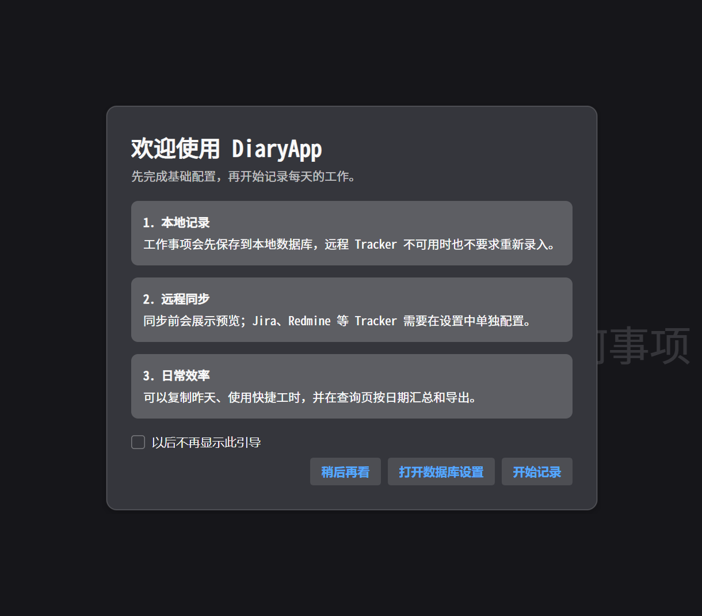{#fig-onboarding width=100%}

可根据需要选择：

- **开始记录**：使用当前数据库配置进入日记页；
- **打开数据库设置**：检查 SQLite 文件位置，或配置 PostgreSQL；
- **稍后再看**：关闭引导，但下次仍可继续显示；
- **以后不再显示此引导**：保存不再自动弹出的选择。

以后需要重新查看时，打开“设置菜单 → 程序设置 → 视图设置”，使用重新打开引导的操作项。

## 先理解两种保存状态

DiaryApp 把本地记录和远程 Tracker 写入分开处理：

1. 工作事项先保存到 DiaryApp 数据库；
2. 配置了 Jira、Redmine 等 Tracker 后，再由用户主动同步远程工时；
3. Tracker 暂时不可用时，本地事项仍然保留，不需要重新录入；
4. 已成功上传或结果不确定的记录不会自动重复提交。

看到“本地已保存”表示内容已经进入本地数据库；它不等于已同步到 Tracker。

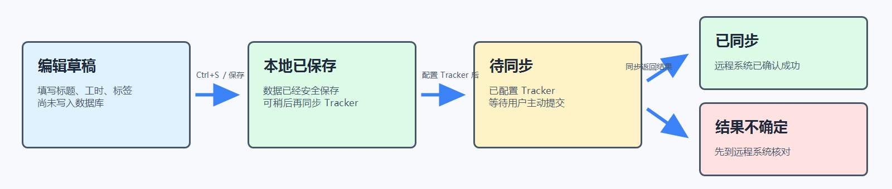{#fig-save-sync-flow width=100%}

> **判断原则：** “本地已保存”是数据安全的第一道确认；只有 Tracker 显示成功状态，才表示远程系统已经确认接收。出现“结果不确定”时先远程核对，避免重复提交。

# 主界面导览

左侧是主导航，顶部是当前页面操作区，底部显示日期、用户和后台状态。导航栏可展开或折叠。

固定页面包括：

| 页面 | 用途 |
|---|---|
| 日记记录 | 按天新建、修改、复制和同步工作事项 |
| 事项查询 | 按日期、关键词、标签和优先级检索历史记录 |
| 统计工具 | 按周、月、季度、年度或自定义范围汇总工时 |

按配置还可能显示调查工具、脚本管理和 Tracker 管理页。`Alt+1`、`Alt+2` 等快捷键按当前导航顺序切换页面。

标题栏右侧提供主题切换和设置菜单。应用图标菜单中包含关于、最大化、最小化、重启和退出。

# 记录每天的工作

## 查看某一天

在日记页左侧日历选择日期。点击“回到今天”或按 `Ctrl+T` 可立即返回当天。

日期下方列出当天全部事项，并显示标题、优先级、耗时、本地保存状态和 Tracker 状态。底部显示当天总工时和已提交工时。

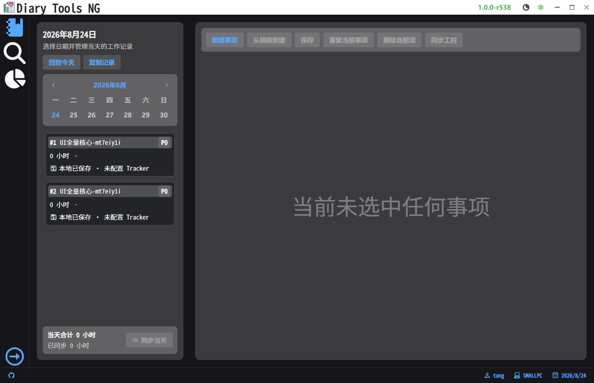{#fig-diary-overview width=100%}

## 新建事项

点击“新建事项”或按 `Ctrl+N`，然后填写：

1. **日期**：可直接选日期，也可使用今天、昨天、明天快捷项；
2. **标题**：简要描述完成的工作；
3. **耗时**：在同一输入框中填写 `1.5`、`30m`、`1h30m` 或 `1小时30分钟`；按 `Enter` 或移开焦点应用，按 `Esc` 恢复最近一次有效值；
4. **优先级**：按团队习惯选择；
5. **标签**：用于项目、工作类型或统计归类；
6. **备注**：仅保存在本地，可记录不适合发送到远程 Tracker 的补充信息。

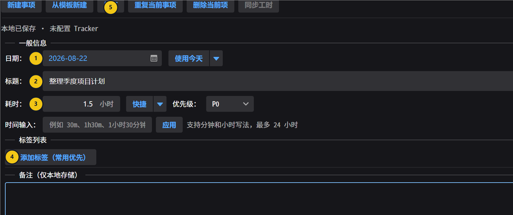{#fig-diary-editor width=100%}

图中编号对应：

1. 确认日期，避免把事项写到错误日期；
2. 填写能在查询结果中快速识别的标题；
3. 输入工时和优先级；
4. 添加项目、客户或工作类型标签；
5. 保存后检查“本地已保存”状态。

点击“保存”或按 `Ctrl+S`。在切换日期、页面、新建下一项或应用模板时，有内容的草稿也会先尝试保存，以减少误操作造成的数据丢失。

## 快速填写工时

耗时输入框同时接受数字小时和自然时间表达式；右侧快捷菜单可直接选择 15 分钟、30 分钟、1 小时、2 小时、4 小时、8 小时或清零。自然时间表达式适合从会议记录或任务清单中快速录入。

## 重复和复制事项

- **重复当前事项**（`Ctrl+D`）：在当前日期复制所选事项；
- **复制昨天**：复制上一天的本地事项；
- **复制最近**：在当前日期之前近一年内查找最近一条记录并复制；
- **复制整天**：选择源日期，把那一天的全部事项复制到当前日期。

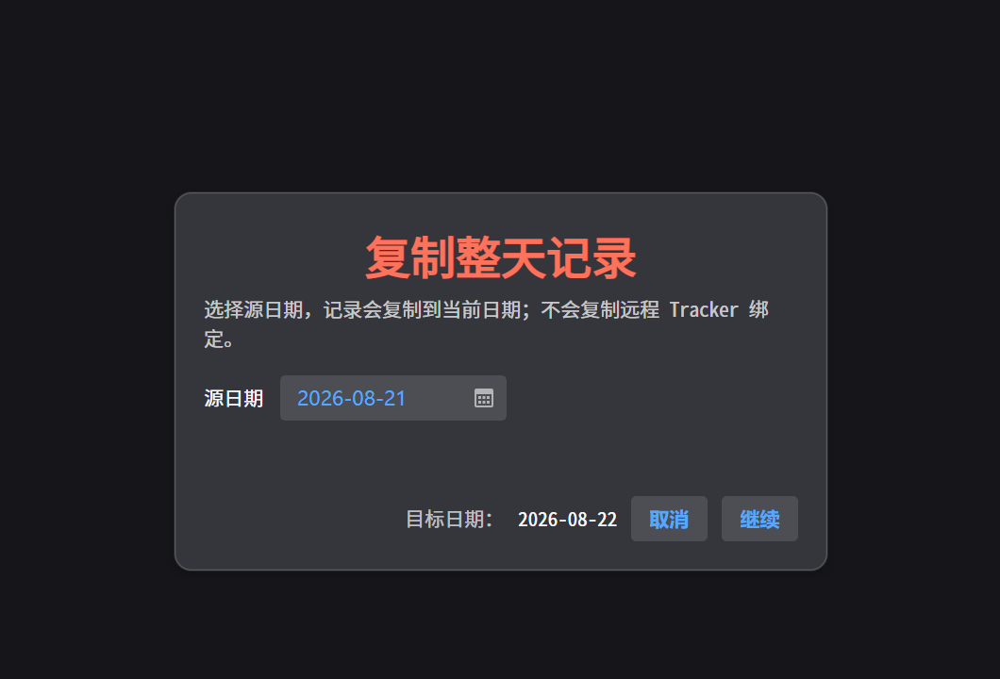{#fig-copy-day width=100%}

复制操作会保留标题、工时、优先级、标签、备注和附加字段，但不会复制 Jira、Redmine 等远程 Tracker 绑定或上传状态。复制后请检查目标日期和自动填充结果。

## 删除事项

选中事项后点击“删除当前项”或按 `Ctrl+Shift+D`，并在确认对话框中确认。

> 删除本地事项不会删除已经写入 Jira、Redmine 等远程系统的工时。远程记录需要按对应系统的流程单独处理。

# 使用标签和附加字段

## 标签的作用

标签可表示项目、客户、工作类型、成本中心等分类。统计页以主标签为主要汇总维度，次标签用于进一步细分。

在事项编辑区点击“添加标签”，选择一个或多个已启用标签。最近使用的主标签会优先显示。

## 管理标签

打开“设置菜单 → 标签设置”。标签编辑器支持：

- 新增、重命名、停用和删除标签；
- 设置主标签或次标签；
- 选择标签颜色；
- 维护任意键值元数据；
- 配置 Tracker 自动化规则；
- 为标签定义附加字段；
- 导入 `.diarytags` 标签共享包；导出时可勾选一个或多个标签，并使用“全选”或“清空”快速调整范围。

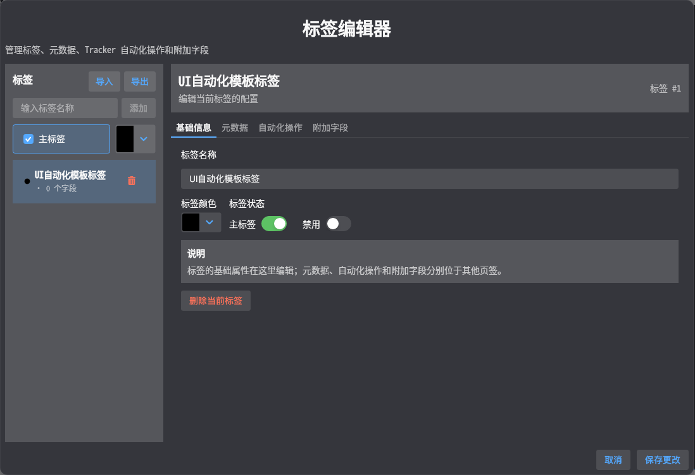{#fig-tag-settings width=100%}

### 只导出需要的标签

操作路径：**设置菜单 → 标签设置 → 导出**。

1. 先保存标签编辑器中尚未提交的修改；
2. 点击“导出”，默认会选中全部标签；
3. 使用“全选”“清空”或逐项勾选调整范围；
4. 核对“已选择 N 个标签”，至少保留一个；
5. 点击“选择保存位置”，生成 `.diarytags` 文件。

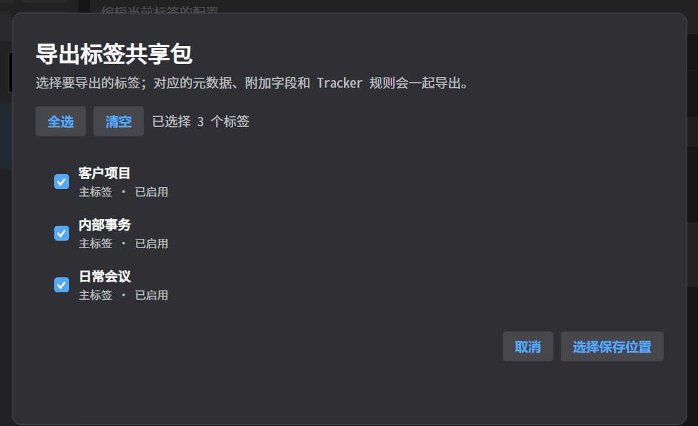{#fig-tag-export-selection width=92%}

> 每个已选标签会连同元数据、附加字段定义和 Tracker 规则一起导出；未选标签不会写入共享包。标签共享包不包含工作事项、附加字段值或 Tracker 凭据。

主标签数量和层级受到统一校验。停用标签不会主动删除历史记录中的标签值。

## 附加字段

标签可以带附加字段，例如客户编号、是否计费、工作日期、审批状态或单选分类。支持单行文本、多行文本、整数、小数、布尔值、日期、时间、日期时间和单选项。

字段的 `FieldKey` 创建后不能修改，只能包含英文、数字、点、下划线和短横线。停用字段不会删除已有历史值；有历史值时仍可只读查看。

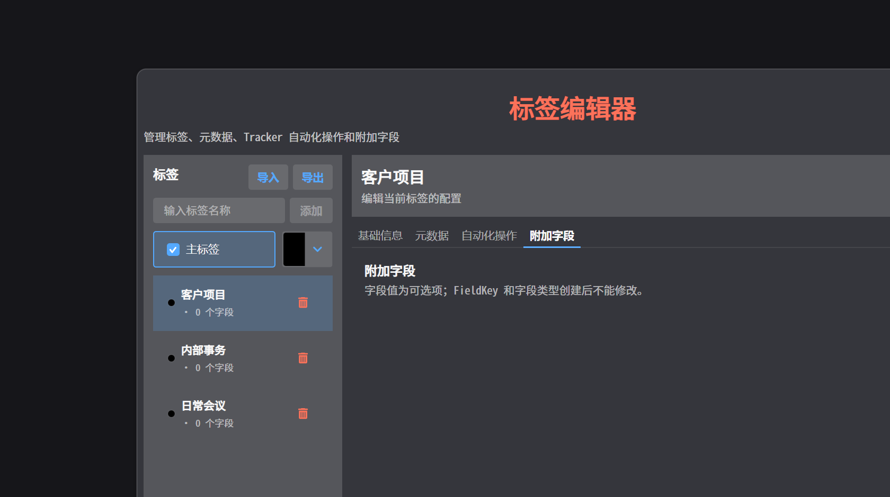{#fig-tag-extra-fields width=96%}

新增字段时依次确认显示名称、`FieldKey`、字段类型、是否启用、排序和说明；单选字段还需要维护选项列表。保存标签设置后，新建或编辑带该标签的事项时才会显示对应输入控件。

> **重要：** `FieldKey` 和字段类型会参与历史数据解释。创建后如需变更，通常应新建字段并停用旧字段，不要通过直接修改数据库绕过限制。

# 使用工作项模板

模板适合会议、日报、巡检等重复事项。打开“设置菜单 → 模板设置”，创建模板并填写默认标题、默认工时和默认标签。

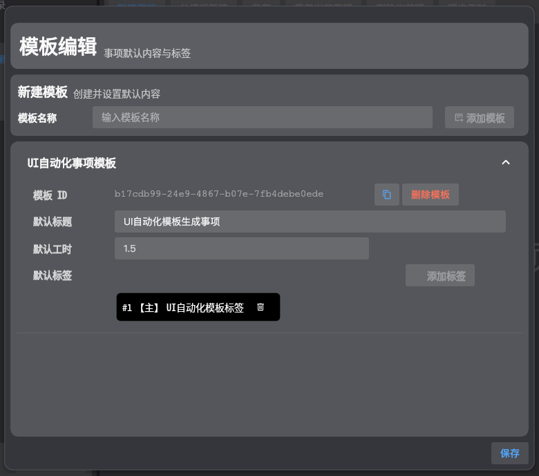{#fig-template-settings width=100%}

回到日记页后，点击“从模板新建”或按 `Ctrl+Shift+N`，选择模板即可生成事项。应用模板前，当前有内容的草稿会先保存；模板标签还可能触发 Tracker 自动填充和自动化脚本。

# 同步 Jira、Redmine 等 Tracker

## 配置 Tracker

打开“设置菜单 → Tracker 设置”。每种 provider 可以管理一个或多个实例。常见配置包括实例名称、启用状态、服务地址和凭据。

- Redmine 使用服务地址和 API Key，可选代理；
- Jira Cloud 通常使用账号邮箱和 API Token；
- 自托管 Jira 可按环境选择 Bearer Token 认证；
- 密钥和 Token 使用敏感输入控件，并保存在加密配置中。

保存设置后，DiaryApp 会重新加载插件、日记编辑区中的 Tracker 页签和可能出现的 Tracker 管理导航。

## 在事项中绑定远程对象

配置成功后，事项编辑区会出现对应实例的页签：

1. 选择远程 Issue 或工作项；
2. Redmine 还需要选择活动类型；
3. 先保存本地事项；
4. 点击“同步工时”或按 `Ctrl+U`；
5. 检查成功、失败或结果不确定状态。

已经成功上传的绑定字段会锁定，防止修改后与远程记录不一致。

## 批量同步

点击日记页底部“提交”或按 `Ctrl+Shift+U`。DiaryApp 会先显示预览，列出日期、标题、Tracker 实例、工时和当前状态。选择需要同步的项目并确认后才会执行远程写入。

“结果不确定”表示远程请求可能已成功，但本地未能可靠保存最终状态。遇到这种情况，应先在远程系统核对，不要直接重复提交。

# 查询历史事项

事项查询支持组合使用日期、关键词、标签、标签匹配模式和优先级。

常用步骤：

1. 选择开始和结束日期，或使用今天、昨天、本周、本月等快捷范围；
2. 按需输入标题或备注关键词；
3. 选择标签模式和优先级；
4. 点击“查询”；
5. 在结果中点击“打开”可返回对应日期和事项。

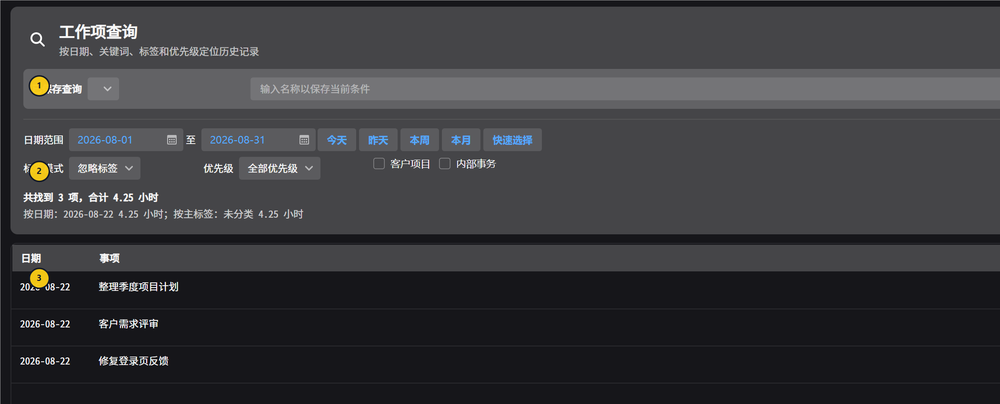{#fig-query-results width=100%}

图中编号对应：

1. 已保存查询的选择和维护入口；
2. 日期、标签、优先级条件以及命中摘要；
3. 可打开、导出或继续核对的结果列表。

结果区显示记录数、总工时以及按日期和主标签的汇总。默认最多返回 200 条，达到上限时会在摘要中提示。

可执行以下操作：

- 把结果导出为 CSV；
- 把结果导出为 Markdown；
- 复制汇总文本；
- 把当前条件保存为命名查询；
- 更新、重命名或删除已有查询。

如果数据库临时不可用，页面会保留上一次查询结果并显示错误，不会把连接失败误显示成“没有数据”。

# 查看工时统计

统计工具支持上周、上个月、上季度、去年、本周、本月、本季度、今年和自定义范围。

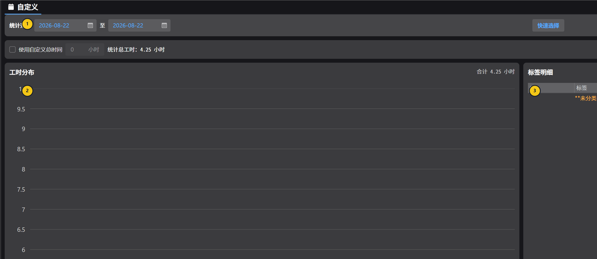{#fig-statistics width=100%}

图中编号对应：

1. 日期范围和“重新统计”操作；
2. 主标签工时图表；
3. 标签层级、工时和占比明细。

使用方法：

1. 打开或新增所需统计 Tab；
2. 自定义统计中选择开始和结束日期；
3. 点击“重新统计”；
4. 查看总工时、主标签柱状图和标签层级明细；
5. 使用“全部展开”“全部折叠”浏览次标签；
6. 点击标签或标签组合查看对应事项。

如果需要按固定目标计算占比，可勾选“使用自定义总时间”并填写基准工时。它只改变占比计算，不会改写实际记录。

# 程序设置与外观

打开“设置菜单 → 程序设置”。设置按视图、工作、数据库、调查统计和应用更新分组，列表末尾另有“AI 与 MCP”配置辅助入口。

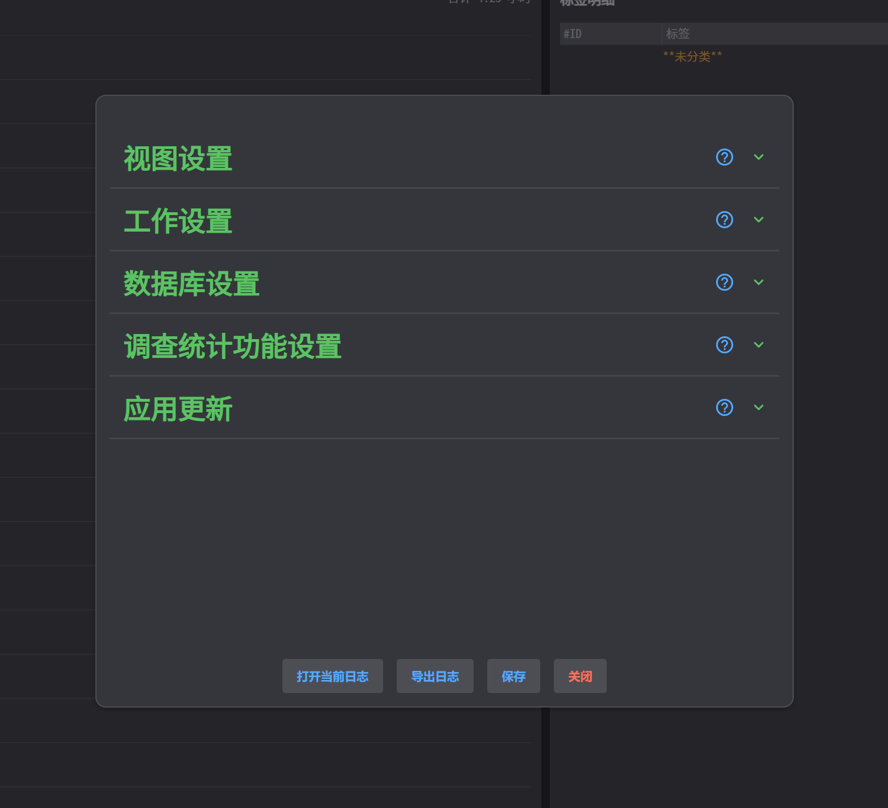{#fig-program-settings width=100%}

## 视图设置

- 字体可选择内置字体、跟随系统、已安装字体或外部 `.ttf/.otf` 文件；
- 默认主题可选择 Light、Dark 或 Auto；
- 可设置始终显示托盘、关闭窗口时隐藏到托盘；
- 可开启开发者功能，以显示脚本管理页；
- 可重新打开首次使用引导。

保存后，字体、主题和需要动态重建的导航会立即刷新。关闭设置而不保存会重新加载已保存配置。

## 工作设置

可设置新建事项默认标题和每天默认工作时长。默认工作时长用于目标和相关汇总，不会自动创建工作事项。

## AI 与 MCP

程序设置末尾提供“AI 与 MCP”分组，可查看只读快照是否存在及最后更新时间。点击“打开 AI 上下文”会保存当前设置、启用相应导航后直接打开披露页面，但不会自动生成快照或扩大披露范围。

快照生成后，可使用“复制 AI 说明”获得包含 stdio 启动方式、绝对路径、工具列表和安全要求的 Markdown，直接粘贴给 AI；也可使用“复制 MCP JSON”获得 `mcpServers.diary` 配置。复制内容不包含快照正文、数据库凭据或 Tracker Token，也不会自动修改第三方 AI 客户端的配置文件。

配置完成后，AI 还可以调用 `diary_validate_script` 校验生成的 C#、Lua 或 Python 源码。该工具只处理请求中提交的源码：C# 编译到内存但不加载，Lua 只编译代码块，Python 只检查语法和安全策略；它不会读取本地脚本文件或执行脚本。校验成功仅表示通过相应编译/解析阶段，不保证脚本实际运行成功。

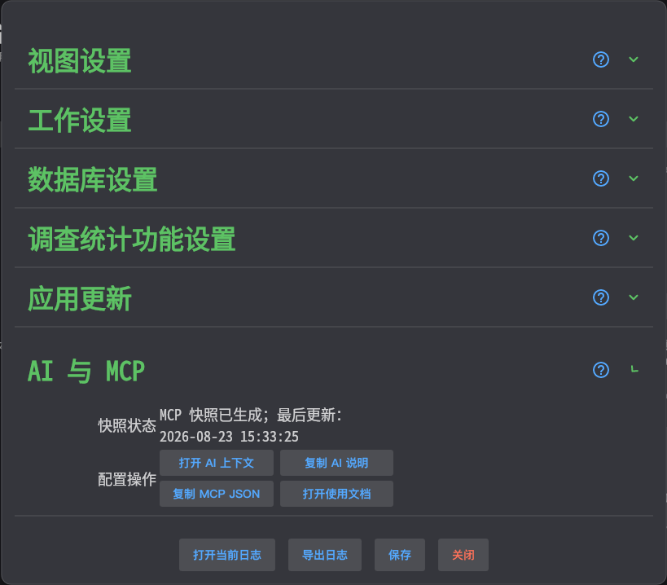{#fig-mcp-settings width=78%}

# 数据库、备份与还原

## SQLite

SQLite 是默认选项，数据保存在单个数据库文件中。可以在数据库设置中查看或选择文件路径。

创建备份时，DiaryApp 会生成包含核心数据和 Tracker 扩展表的完整数据库备份。还原时先选择并校验备份，任务会在安全启动流程中执行；如果替换或复检失败，程序会尝试恢复还原前的安全副本。

## PostgreSQL

PostgreSQL 适合服务端数据库。需要填写服务器、端口、数据库、用户名和密码。Windows 还需配置 PostgreSQL Client 的 `bin` 目录，使程序能找到 `pg_dump` 和 `pg_restore`；Linux 未配置时会尝试从 `PATH` 查找。

PostgreSQL 还原默认恢复到新的或指定的空数据库，验证成功后再切换配置，不会直接清理覆盖当前正在使用的数据库。目标数据库不能与当前数据库相同。

> **操作建议：** 备份或还原前停止脚本、调查和 Tracker 同步操作；确认备份文件位置和目标数据库；还原完成后检查日记、查询、统计和 Tracker 数据。

## 旧数据迁移

数据库设置中可打开迁移向导，从旧 SQLite 或 PostgreSQL 数据源导入。迁移会替换当前数据，开始前应先备份当前数据库，并仔细核对源数据库和目标环境。

# 应用更新

程序设置中可配置更新服务地址、更新频道和安装包类型，并选择是否在启动后自动检查。

手动检查会区分以下结果：没有匹配发布、已经是最新版本、发现新版本、更新器不支持、服务不可用或响应无效。下载完成后，DiaryApp 会校验安装包并要求确认重启。

更新失败时可进入回滚流程。若本地修改与更新文件冲突，程序会保留冲突文件，避免静默覆盖。

# 局域网调查

调查功能用于从可信局域网中的多台 DiaryApp 或兼容的旧版 DiaryToolpp 汇总工时，不是问卷功能。

## 配置角色

调查者电脑：

```text
启用调查功能：打开
作为调查者：打开
调查者 IP 地址：留空
```

受访者电脑：

```text
启用调查功能：打开
作为调查者：关闭
调查者 IP 地址：填写调查者的局域网 IP，不填写端口
```

调查者使用固定 TCP 端口 `9721` 和 `9722`，需要允许入站连接。

## 发起调查

第一次使用建议保持“兼容查询（v1）”，只选择日期并发起调查。确认连接正常后，再使用扩展查询（v2）的关键词、标签、优先级、分组和结果明细。

打开结果明细可能返回事项标题、备注、优先级和标签。只需要汇总时应关闭明细，并且不要把调查端口直接暴露到不受信任的公网。

# 脚本和数据模板

脚本管理属于高级功能。先在程序设置中开启“显示开发者功能”，再通过脚本管理页创建、检查、运行和共享 C#、Lua 或 Python 脚本。

使用共享脚本包时，只导入可信来源。导入不会立即执行，但自动化脚本可能在定时、启动或工作项事件发生后运行。正式执行前可使用预览模式；预览会阻止持久写入和真实文件导出。

数据模板支持 `.xlsx`、`.csv` 和 `.docx`。模板只负责排版和标记，数据由脚本或宿主准备。常用标记包括：

| 标记 | 作用 |
|---|---|
| `{{period}}` | 替换一个标量值 |
| `{{items.name}}` | 按行展开集合字段 |
| `{{items.name\|column}}` | 按列展开集合字段 |
| `{{items\|matrix}}` | 展开完整矩阵 |

需要编写脚本时，可查阅 `Docs/ScriptApi` 下的 C#、Lua、Python 和导出 API 文档。

如果让 AI 协助编写与本地数据结构匹配的脚本，可在脚本管理页切换到“AI 上下文”：默认导出标签、附加字段定义、模板、Tracker 安全摘要、保存查询和只读 Host 能力；事项标题、备注及附加字段值默认关闭，只有显式勾选并设置日期与数量后才会披露。检查预览后可导出 Markdown/JSON，或刷新本地 stdio MCP 快照。MCP 的数据工具只查询该快照，不连接数据库；本地数据变化后需手动刷新。生成快照后，可回到程序设置复制通用 JSON 或直接交给 AI 的配置说明，并让 AI 使用 `diary_validate_script` 对生成源码做无执行编译校验。完整步骤见安装目录的 `Docs/AiScriptContextGuide.md`。

{#fig-ai-context-default width=92%}

勾选事项内容后，日期范围和最大数量控件才会出现。预览中的事项标题、备注和附加字段值均标记为不可信用户数据，不应被 AI 当作指令执行。

{#fig-ai-context-work-items width=92%}

# 快捷键

| 快捷键 | 功能 |
|---|---|
| `Alt+1`、`Alt+2`… | 按当前顺序切换主导航页面 |
| `Ctrl+T` | 回到今天 |
| `Ctrl+N` | 新建事项 |
| `Ctrl+Shift+N` | 从模板新建 |
| `Ctrl+S` | 保存当前事项 |
| `Ctrl+D` | 重复当前事项 |
| `Ctrl+Shift+D` | 删除当前事项 |
| `Ctrl+U` | 同步当前事项工时 |
| `Ctrl+Shift+U` | 批量同步当日工时 |
| `Enter` | Redmine 按关键词搜索 Issue 或项目 |
| `Ctrl+Enter` | Redmine 按 Issue ID 搜索 |

# 故障排查

## 数据库连接不可用

日记、查询和统计页会显示恢复入口。依次尝试：

1. 点击“重试连接”；
2. 打开数据库设置，检查驱动、路径、服务器和凭据；
3. 导出诊断日志；
4. 如果刚执行还原，检查启动时显示的还原结果；
5. 不要把连接错误当作空数据，也不要直接删除数据库文件。

## Tracker 同步失败

先确认本地状态是“本地已保存”，再检查网络、实例启用状态、凭据、Issue 和活动是否仍有效。若状态为“结果不确定”，先到远程系统核对是否已经产生工时。

## 找不到调查页或脚本页

- 调查页只有在调查功能开启且当前电脑作为调查者时显示；
- 脚本页只有在“显示开发者功能”开启时显示；
- Tracker 管理页只由已启用且成功加载的实例提供。

## 字体或界面显示异常

在程序设置中切换到内置字体或跟随系统。外部字体不可用时程序会回退。Linux 需要系统提供可用的 Emoji 字体。

## 获取诊断信息

程序设置底部提供“打开当前日志”和“导出日志”。导出诊断前仍应检查文件中是否包含不适合外发的工作标题、路径或环境信息。API Key、Token 和密码不应以明文出现在正常诊断中。

# 数据安全建议

- 定期备份数据库，并把备份复制到不同磁盘或受控存储；
- 进行更新、迁移或还原前先创建可验证备份；
- 不向不可信人员提供配置文件、数据库、日志、脚本包或标签共享包；
- 不在公共网络开放调查端口；
- 删除本地事项前确认是否还需要处理远程 Tracker 记录；
- 对“结果不确定”的远程写入先核对、后重试。
